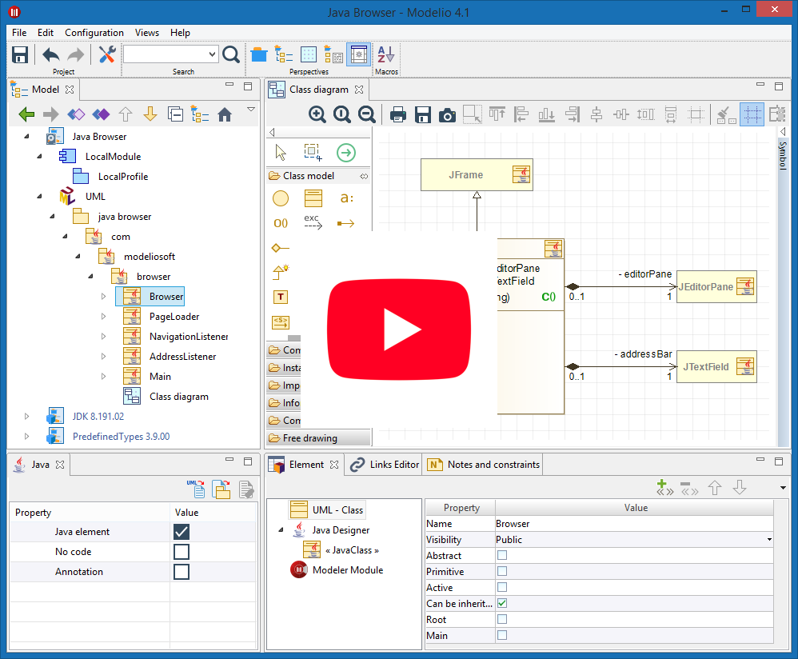

Modelio is a modeling solution offering a wide range of functionalities based on the main standards of enterprise architecture, software development and systems engineering.

Dedicated to developers, analysts and software and systems architects, Modelio is first and foremost a modeling environment, supporting a wide range of models and diagrams and providing many services facilitating the modeling of your architectures such as as model consistency checking features. Support for modeling and business processes (BPMN) is integrated into Modelio. These BPMN models can be linked to other standards supported by the tool, for example UML, so as to integrate these business processes into a larger context such as an enterprise architecture.

</table>
<table>
<tr>
<td>

# Main Features

* **UML Modeler** : Modelio is a first and foremost a modeling environment, supporting a wide range of models and diagrams, and providing model assistance and consistency checking features.
* **BPMN support** integrated with UML : Modelio combines BPMN support and UML support in one tool, with dedicated diagrams to support business process modeling.

* **Java code generator** : The Java Designer module uses an RCP/Eclipse-style project file structure, and supports Java code generation and reverse, Javadoc generation and Java automation.
* **XMI import/export** : Modelio provides an XMI import/export feature that enables you to exchange UML2 models between different tools.
* **HTML model publishing** : With the HTML Publisher module, publish your models in HTML format.
* **Extension system** : Modelio can be extended for any language, methodology or modeling technique just by adding modules to your configuration. You can either use existing modules or else develop your own.
* **Scripting language support (Jython)** : Modelio provides integrated support of the Jython scripting language, for online requests, small scripts and macro definition. 

</td>
<td>

# Supported Standards
* **UML2** : UML2 is a general-purpose modeling language from the OMG, used in the field of object-oriented software engineering.
* **BPMN2** : BPMN is a standard for business process modeling, providing a graphical notation for the specification of business processes.
* **Archimate** : Archimate is an open and independent enterprise architecture modeling language to support the description, analysis and visualization of architecture within and across business domains. 
* **XMI** :XMI is an OMG standard used in the exchange of metadata information via the XML language.
* **MDA** : MDA is an OMG standard, which implements and uses model extensions in the development of software systems.
* **TOGAF** :TOGAF is an enterprise architecture framework, providing a complete approach to enterprise information architecture design, planning, implementation and governance.

</td>
</tr>
</table>
