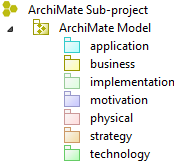
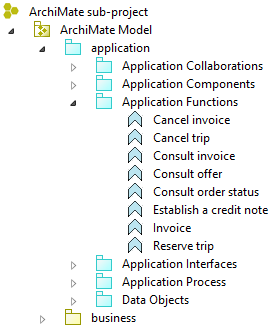
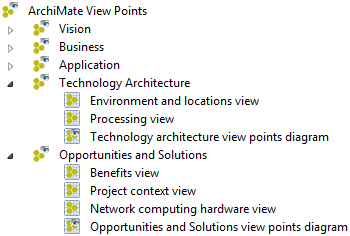
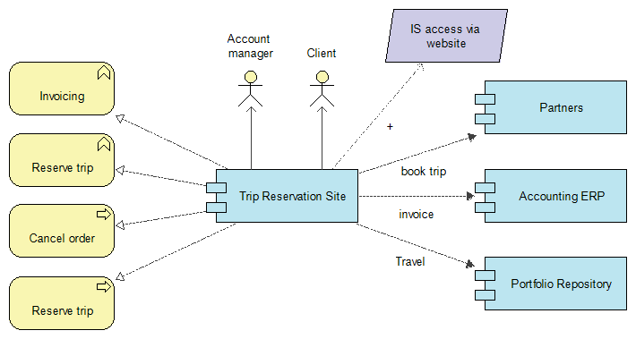
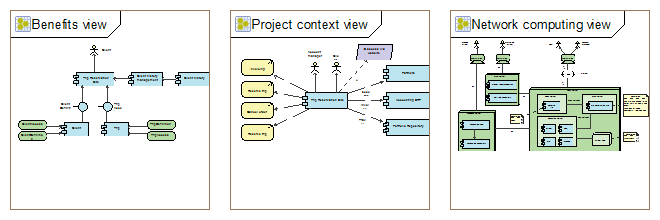

// Disable all captions for figures.
:!figure-caption:

[[document-title]]
[[archimate-model]]
= ArchiMate model

[[HArchiMatesub-project]]
==  ArchiMate sub-project image:images/attachment/archimate41/User_Documentation_en_os/ArchimateModel/archimate.png[archimate.png]

Since version 3.6, Modelio supports several kind of sub-projects (UML, MDA, ArchiMate...). These sub-projects can coexist within the same work model.

An image:images/attachment/archimate41/User_Documentation_en_os/ArchimateModel/archimate.png[archimate.png] ArchiMate sub-project is organized into two distinct parts: the  *model* that contains all the ArchiMate concepts and links, and the  *view points* containing a partial representation of the model grouped for specific purposes.

[[HArchiMateModel]]
=  ArchiMate Model 

The ArchiMate Model hosts all ArchiMate elements defined in the sub-project.

These element are not structured hierarchically by the Model. As we will see later in this documentation,an ArchiMate model is structured using viewpoints and views. In order to ensure good readability of the model, Modelio organizes ArchiMate elements by grouping them according to their Layer. When an ArchiMate element is created in a view, it is automatically attached to its corresponding layer.

*Business Layer:* The Business Layer is typically used (often in conjunction with the strategy layer) to model the business architecture of an enterprise, defined as a description of the structure and interaction between the business strategy, organization, functions, business processes, and information needs.

*Strategy Layer:* The strategy elements are used to model the capability on an organisation, and how they are to be changed in order to achive business outcomes.

*Motivation Layer:* Motivation elements are used to model the motivation, or reasons, that guide the design of change of an Entreprise Architecture.

*Application Layer:* The Application Layer is typically used to model the information systems architectures of the enterprise, including the application architecture that describes the structure and interaction of the applications.

*Technology Layer:* The Technology Layer is typically used to model the technology architecture of the enterprise, defined as the structure and interaction of the platform services, and logical and physical technology components.

*Physical Layer:* The physical elements are added as an extention to the Technological Layer for modeling the physical world.

*Implementation and Migration Layer:* The implementations and migration elements support implementation and migration of architectures. This include concepts for modeling implementation, and a plateau concept to support migration planning.

Modelio support alose the manual creation of sub layer allowing you to reorganize the Model as your convenience, to store ArchiMates elements by type or following business requirements.

.Example of folders by type

[[HViewPointsandViews]]
= ViewPoints and Views

An ArchiMate model can adress a big variety of problematics supporting concerns of various stakeholders like Architects, Operational Manager, Project Manager or Developers. ArchiMate advocates a flexible approach in which, architects and other stakeholders can define their own visualisation on the enterprise architecture. This specific organisation is realized using Views  and View Points ,

*An ArchiMate View* is a partial representation of the model. It's a photo of a set of model element displayed in the same diagram and selected according to business, user profile or interests criteria.

.An ArchiMate view 

*ArchiMate View Points * define abstractions on the set of models elements representing the enterprise architecture, each aimed at a particular type of stakeholder and addressing a particular set of concerns. View Points can be used to visualize certain aspects in isolation, and to relate two or more aspects. Consequently, a View Point is a set of views grouped by particular interests: business, user profile or intention. The set of model elements composing a View Point results of the aggregation of elements displayed in views.

.An ArchiMate ViewPoint diagram 

