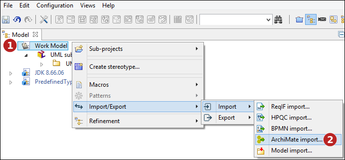
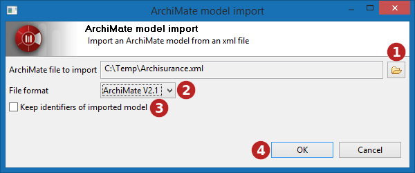
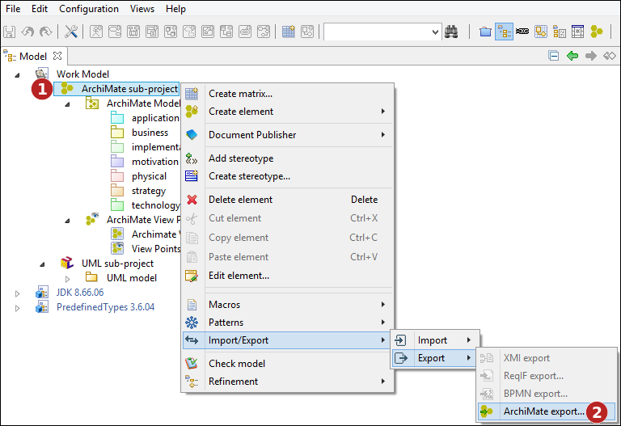
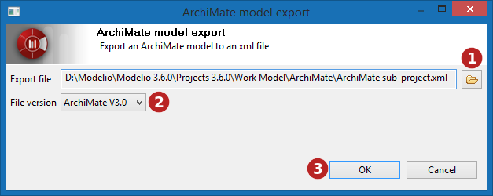

// Disable all captions for figures.
:!figure-caption:

[[document-title]]
[[import-and-export]]
= Import and export

Modelio offers a feature to exchange ArchiMate models defined with the Open Group ArchiMate Model Exchange File Format. This will allow you to exchange models with other modeling tools such as Archi.

[[HSupportedformatandversions]]
= Supported format and versions

The ArchiMate exchange feature supports the 2.1 and 3.0 ArchiMate Model Exchange File Format, as defined by the Open Group (https://www.opengroup.org/xsd/archimate/),

A snapshot version of the 3.1 Model Exchange File Format is also supported, despite the format currently being under development. Therefore, it might not be fully compatible with other tools till the format is officially release by the Open Group.

[[HRunningtheArchiMateimportcommand]]
= Running the ArchiMate import command

The ArchiMate import command is available in the context menu of an ArchiMate sub-project, or of a work model:

*Steps:*

1. Right-click on the work model or on the ArchiMate sub-project.
2. Run the "ArchiMate import..." command.

[[HSelectingafiletoimport]]
== Selecting a file to import

*Steps:*

1. Select the file to import.
2. Indicate the format of the file to import.
3. Whether or not the import should keep the identifiers defined in the imported file, or map them to new modelio identifiers (UUIDs).
4. Launch import.

*Note:* when keeping identifiers, each element already existing in the model and having the same identifier as an imported element will automatically be updated.

[[HRunningtheArchiMateexportcommand]]
= Running the ArchiMate export command

The ArchiMate export command is available in the context menu of an ArchiMate sub-project or an ArchiMate model:

*Steps:*

1. Right-click on the ArchiMate sub-project. +
2. Run the "ArchiMate export..." command.

[[HSelectingtheexporttarget]]
== Selecting the export target

*Steps:*

1. Select the path of the exported ArchiMate file. +
2. Indicate the format of the file to export. +
3. Launch export.
