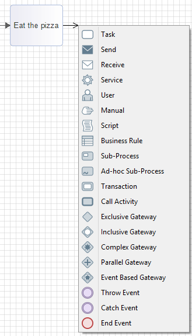
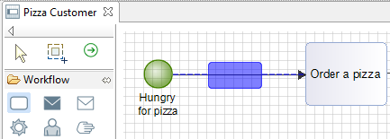
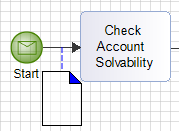
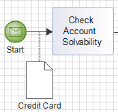
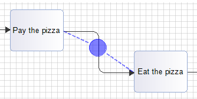
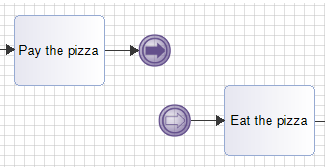

// Disable all captions for figures.
:!figure-caption:
// Path to the stylesheet files
:stylesdir: .

= Advanced workflow creation

== Smart sequence flow tool

=== Link mode

The _BpmnSequenceFlow_ creation tool has the standard link creation behavior when used between two workflow elements. For example, from a task to another, creation is direct.

=== Element mode

When used between an element and the diagram's background or a _BpmnLane_, a popup opens to choose which element is to be created ( _BpmnTask_, _BpmnEvent_...) as the new link's target.

For example : from a task, right clicking on the diagram's bottom allows to create a task in the diagram, linked to the original task through a _BpmnSequenceFlow_.

.Creating an element from a link using right click or CRTL key

== Inserting workflow nodes

Creating a workflow element ( _BpmnTask_, _BpmnGateway_...) on a _BpmnSequenceFlow_ *F* inserts the node in the sequence :

* a _BpmnSequenceFlow_ is created between *F* 's source and the new element;
* another _BpmnSequenceFlow_ is created between the new element and *F* 's target.

.Inserting a task on a Sequence Flow
image::images/attachment/bpmn41/User_Documentation_en/BPMN_Diagrams/Advanced_workflow_creation/WebHome/TaskInsertion2.png[TaskInsertion2.png]

== Inserting Data Object nodes

Creating a _BpmnDataObject_ on a _BpmnSequenceFlow_ *F* effectivly creates a model corresponding to a data transmission through the flow:

* a _BpmnDataAssociation_ is created between *F* 's source and the new _BpmnDataObject_;
* another _BpmnDataAssociation_ is created between the new _BpmnDataObject_ and *F* 's target;
* a _BpmnSequenceFlowDataAssociation_ is created between the _BpmnDataObject_ and *F*. 

 
.Inserting a Data Object on a Sequence Flow

== Creating Throw/Catch Link Event pairs

Creating a _BpmnIntermediateCatchEvent_ or a _BpmnIntermediateThrowEvent_ on a _BpmnSequenceFlow_ *F* inserts a sequence break in the workflow:

* a _BpmnSequenceFlow_ is created from *F* 's source to a _BpmnIntermediateThrowEvent ;_
* a _BpmnSequenceFlow_ is created from a _BpmnIntermediateCatchEvent_ to *F's target* _;_
* both _BpmnIntermediateCatchEvent andBpmnIntermediateThrowEvent_ are linked in the model itself.

N.B. : when Throw/Catch events are linked, selecting one of them in a diagram displays a link to the other.

 

.Throw/Catch Links events insertion

