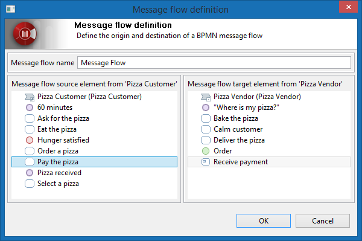

// Disable all captions for figures.
:!figure-caption:
// Path to the stylesheet files
:stylesdir: .

= Collaboration diagram

==  Collaboration diagram image:images/attachment/bpmn41/User_Documentation_en/BPMN_Diagrams/Collaboration_diagram/WebHome/bpmncollaborationdiagram.png[bpmncollaborationdiagram.png]

BPMN Collaboration diagrams are attached to BPMN Collaborations which are structured inside packages or BPMN Processes.

BPMN Collaboration diagrams are dedicated to modeling interactions between processes using Message Flows.

In a Collaboration diagram the Processes are represented using Participants, which can be of 3 kinds:

image:images/attachment/bpmn41/User_Documentation_en/BPMN_Diagrams/Collaboration_diagram/WebHome/localprocess.png[localprocess.png] Local Process/Participant: this kind of Participant references a Process which own the Collaboration, and is then "local" to the Collaboration. It is therefore editable directly in the Collaboration Diagram.

 Referenced Process/Participant: this kind of Participant references a Process which doesn't own the Collaboration and is then "outside" the Collaboration. It is therefore not editable directly in the Collaboration diagram. To edit the content of the Participant you must edit the Process Design Diagram of the referenced Process. (use the 'Related diagrams' contextual command on the Participant to navigate to it directly).

image:images/attachment/bpmn41/User_Documentation_en/BPMN_Diagrams/Collaboration_diagram/WebHome/externalparticipant.png[externalparticipant.png] External Process/Participant: this kind of Participant doesn't reference any Process and is then "external" to the model. It has therefore no content that can be edited.

[[HPizzaCollaborationexample]]
=== Pizza Collaboration example

.The "Pizza Collaboration" diagram
image::images/attachment/bpmn41/User_Documentation_en/BPMN_Diagrams/Collaboration_diagram/WebHome/Collaboration_diagram.png[Collaboration diagram.png]

In this Collaboration diagram, the 3 kinds of Participants are represented :

- "Pizza Vendor" is a local participant, referencing the "Pizza Vendor" process, which owns the Pizza Collaboration.

- "Pizza Customer" is a referenced participant, referencing the "Pizza Customer" process, which is located somewhere else in the model.

- "Bank" is an external participant, it references no process.

[[HMessageFlows]]
== Message Flows

Collaboration diagrams main goal is to model interactions between processes. To do so Messages Flow must be used.

Messages Flows can be drawn between Tasks, Sub-Processes, Events, that belongs to differents Participants as well as between Participants themselves.

N.B: Deleting elements linked by Message Flows will pop-up a confirmation wizard.

[[HMessageFlowscreationwizard]]
=== Message Flows creation wizard

The MessageFlow creation GUI interaction has to match the representation modes and the nature (external or not) of the source and target participants.

* In 'Simple' participants display mode, Modelio displays a window with a list of source participants and compatible targets.

* In 'Structured' participants display mode, Modelio lets the user bind sources and targets directly.

* For hybrid situations (source or target in participants displayed in different modes), Modelio offers both the selection window and the direct creation.

* For external participants, obviously, no particular assistance is provided.

.Message Flow Definition wizard

