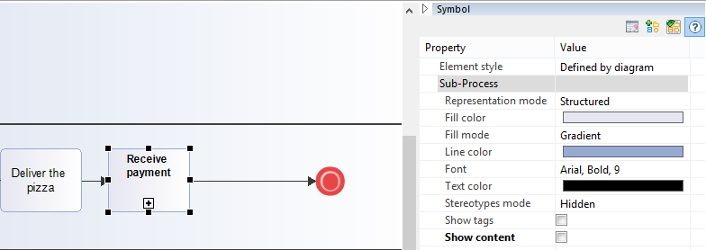
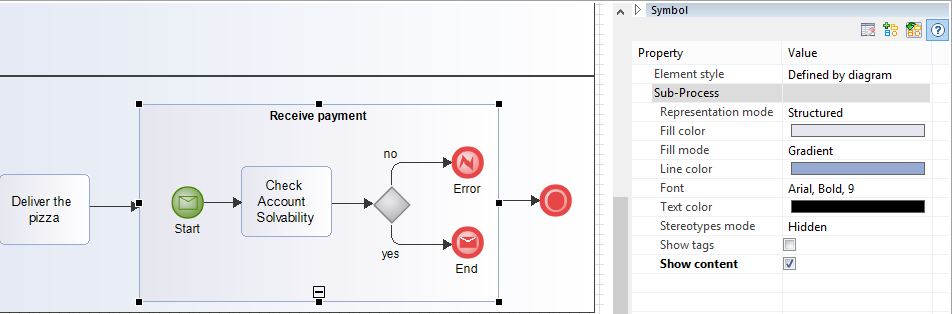

// Disable all captions for figures.
:!figure-caption:

= Sub-Process diagram

==  Sub-Process diagram image:images/attachment/bpmn41/User_Documentation_en/BPMN_Diagrams/SubProcess_diagram/WebHome/bpmnsubprocessdiagram.png[bpmnsubprocessdiagram.png]

BPMN Sub-Process diagrams model processes at sub-process level.

[[HTheReceivePaymentexample]]
=== The Receive Payment example

.The Receive Payment Sub-Process Diagram example
image::images/attachment/bpmn41/User_Documentation_en/BPMN_Diagrams/SubProcess_diagram/WebHome/Sub-Process_Diagram_2.png[Sub-Process Diagram 2.png]

Sub-Process diagrams can also be shown in other BPMN diagrams by checking the 'Show content' option in the Symbol view of a Sub-Process :

.A collapsed Sub-Process

.An expanded Sub-Process

