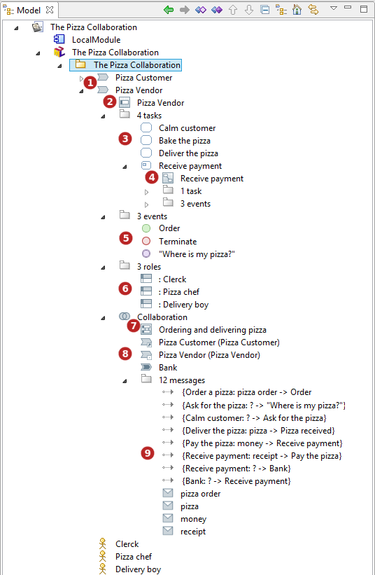

// Disable all captions for figures.
:!figure-caption:

= BPMN Model Browser

*Keys :*

1. Processes.
2. Process Design Diagram.
3. Tasks folder.
4. Sub-Process and its Sub-Process Diagram.
5. Events folder.
6. Roles folder.
7. Collaboration and its Collaboration Diagram.
8. Participants.
9. Messages folder.
