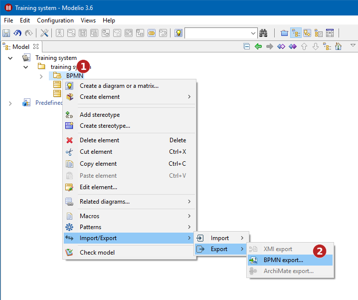
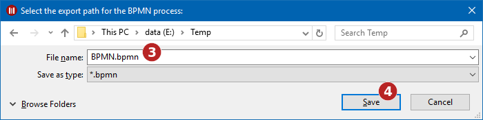

// Disable all captions for figures.
:!figure-caption:
// Path to the stylesheet files
:stylesdir: .

= Exporting a model in BPMN format

The BPMN Export service is used to generate BPMN files from a BPMN model built in Modelio.

To export a BPMN model :

1. Select the BPMN model to export in the project explorer.
2. Use the *Import / Export > Export > Export BPMN* contextual command.

.Exporting a BPMN Model

*Steps:*

1. Select the BPMN model.
2. Run the *Import/Export > Import > BPMN export* command.
3. Choose a name for the exported file.
4. Click on Save to validate and launch the export process.

*Note:* Some BPMN models might need to be normalized before export. Make sure your model is in *read/write* mode before launching the command.
