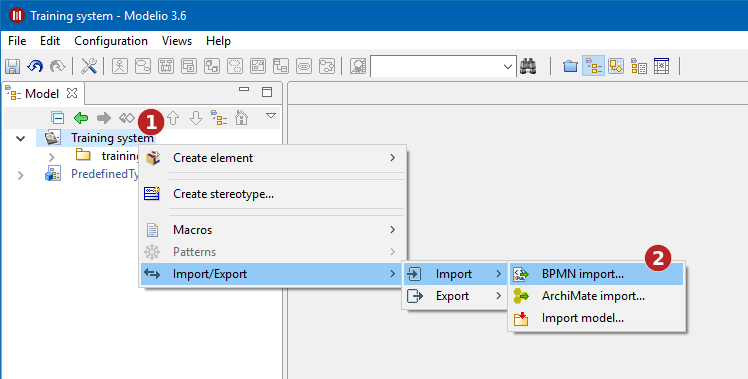

// Disable all captions for figures.
:!figure-caption:
// Path to the stylesheet files
:stylesdir: .

= Importing a model in BPMN format

== Introduction

The Modelio BPMN Import service is used to import a BPMN model form a *.bpmn file. It also allows to update an existing and previously imported BPMN model based on an updated *.bpmn file.

During the import process, you can choose to keep the ID of the elements declared in the imported file, or to generate new Modelio ID. If you choose to keep the original elements id, you must keep in mind that these ID must be unique. Otherwise, you will be exposed to unexpected errors during the import process.

== Importing a BPMN Model

To import a BPMN model form a *.bpmn file:

1. Select a root package in the project explorer.
2. Use the *Import/Export > Import > Import BPMN* contextual command.

.The BPMN import process
image::images/attachment/bpmn41/User_Documentation_en/Importing_and_exporting_models/Importing_a_model_in_BPMN_format_in_BPMN_format/bpmn_import_2.png[bpmn_import_2.png]

*Steps:*

1. Click on the work model root package.
2. Run the *Import/Export > Import > BPMN Import* command.
3. Browse your file system to the BPMN file to import.
4. Choose whether or not to keep the imported elements IDs.
5. Click on *OK* to validate and launch the import.

== Update a BPMN Model

To update an existing BPMN model based on an updated *.bpmn file:

1. Select the BPMN model to update in the project explorer.
2. Use the *Import/Export > Import > Import BPMN* contextual command

image::images/attachment/bpmn41/User_Documentation_en/Importing_and_exporting_models/Importing_a_model_in_BPMN_format_in_BPMN_format/bpmn_import_3.png[bpmn_import_3.png]

.Updating a BPMN Model
image::images/attachment/bpmn41/User_Documentation_en/Importing_and_exporting_models/Importing_a_model_in_BPMN_format_in_BPMN_format/bpmn_import_2.png[bpmn_import_2.png]

*Steps:*

1. Click on the BPMN root package.
2. Run the *Import/Export > Import > BPMN Import* command.
3. Browse your file system to the BPMN file to import.
4. Choose whether or not to keep the imported elements IDs.
5. Click on *OK* to validate and launch the update.
