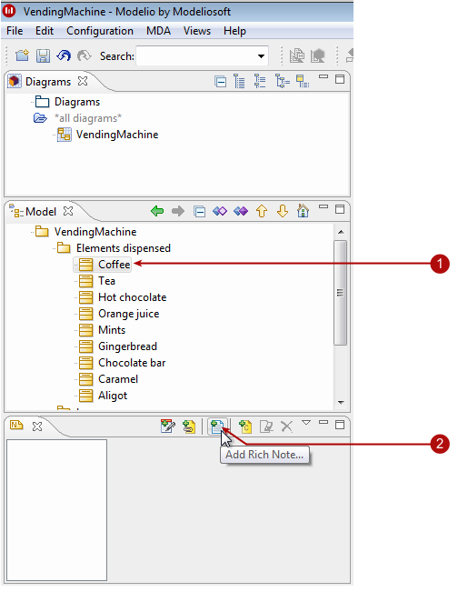

// Disable all captions for figures.
:!figure-caption:

[[Adding-rich-notes-to-elements]]

[[adding-rich-notes-to-elements]]
= Adding rich notes to elements

Modelio lets you create rich notes. These rich notes can be MS Office documents or OpenDocuments (LibreOffice or OpenOffice).

[[Creating-a-rich-note]]

[[creating-a-rich-note]]
== Creating a rich note

.The rich note creation process

*Steps:*

1. Select the element you want to add a rich note to.
2. In the "Notes & constraints" view, click on the "Add rich note" button. The "Create a rich note" window then appears. image:images/Modeler-_modeler_building_models_add_richnotes_modifelements_009_2.png[3]
3. In the "Create a rich note" window, give the note a name by clicking in the "Rich note name" field and then entering the name of the note.
4. In the "Rich note role" field, choose a role from the list.
5. In the "MIME format" field, choose a format from the list.
6. Finally, add a short description of your note in the "Abstract" field.
7. Click on OK to create the rich note.

*Note:* In case Modelio cannot find automatically the OpenDocuments editor (LibreOffice or OpenOffice), check the <<Modeler-_modeler_modelio_settings_preferences.adoc#,LibreOffice/OpenOffice Rich Notes settings>> in Modelio settings.

[[The-rich-note-editor]]

[[the-rich-note-editor]]
== The rich note editor

.The rich note editor
image::images/Modeler-_modeler_building_models_add_richnotes_modifelements_010.png[2]

*Note:* MS Office rich notes are saved using the second image:images/Modeler-_modeler_building_models_add_richnotes_save_16.png[4] button in the Modelio toolbar

[[Create-a-template-for-new-rich-notes]]

[[create-a-template-for-new-rich-notes]]
== Create a template for new rich notes

You can create a default file for each role name. These files should be stored in the .projectdata/admin/documents directory.

The template file can be named:

* role-name.mime-type.dat like file
* role-name.dat like file.

All invalid characters in a file name in the document type and MIME type are replaced by '_' when the file is searched for. Invalid characters are [ : \ / * ? | < > ].

The following is a list of all MIME types available in Modelio:

[cols=",",options="header",]
|======================================================================================================================
|Format |Mime type
|HTML (LibreOffice) |text/html/ooo.html
|HTML (Word) |text/html.html
|Microsoft Excel 2000 |application/vnd.ms-excel.xls
|Microsoft Excel 2007 |application/vnd.openxmlformats-officedocument.spreadsheetml.sheet.xlsx
|Microsoft PowerPoint |application/vnd.ms-powerpoint.ppt
|Microsoft PowerPoint 2007 Presentation |application/vnd.openxmlformats-officedocument.presentationml.presentation.pptx
|Microsoft Word 2007 |application/vnd.openxmlformats-officedocument.wordprocessingml.document.docx
|Microsoft Word 6 |application/msword.doc
|OpenOffice Calc Spreadsheet |application/vnd.oasis.opendocument.spreadsheet.ods
|OpenOffice Draw Graphic |application/vnd.oasis.opendocument.graphics.odg
|OpenOffice Formula |application/vnd.oasis.opendocument.formula.odf
|OpenOffice Impress Presentation |application/vnd.oasis.opendocument.presentation.odp
|OpenOffice Web Text |application/vnd.oasis.opendocument.text-web.odh
|OpenOffice Writer Text Document |application/vnd.oasis.opendocument.text.odt
|RTF |text/rtf.rtf
|======================================================================================================================

