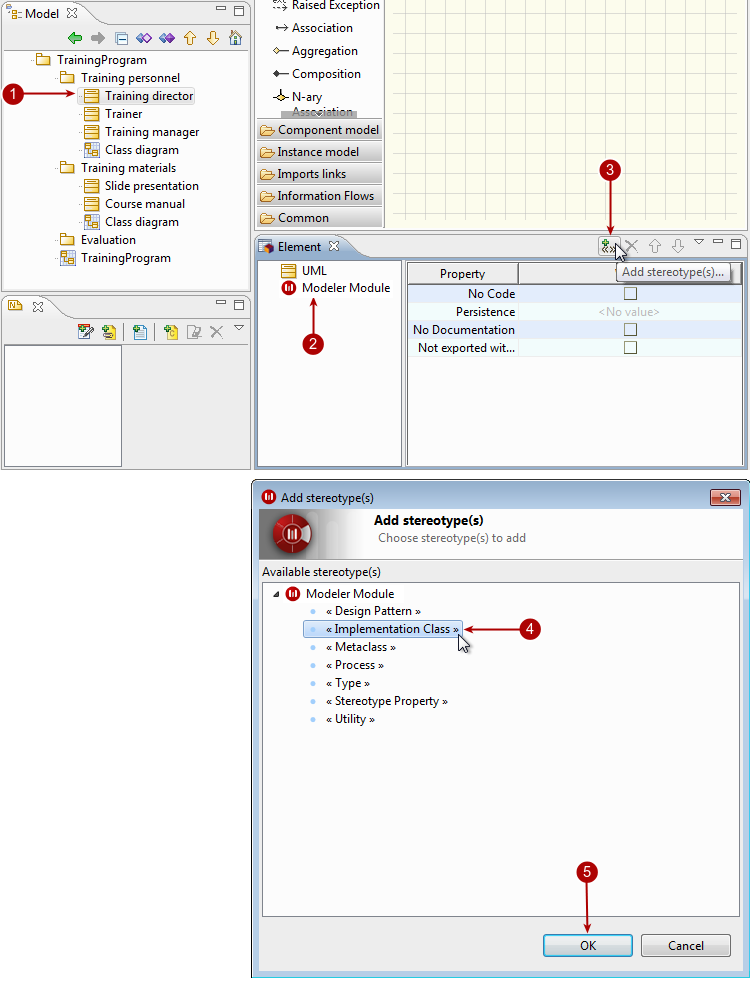

// Disable all captions for figures.
:!figure-caption:
// Path to the stylesheet files
:stylesdir: .

[[Adding-stereotypes-to-elements]]

[[adding-stereotypes-to-elements]]
= Adding stereotypes to elements

There are two ways to add stereotypes to elements:

* Using the "Add stereotype(s)..." command from the context menu of the selected element.
* In the <<Modeler-_modeler_interface_properties_view.adoc#,Properties>> or <<Modeler-_modeler_interface_uml_prop_view.adoc#,Element>> view on the selected element.

.Adding a stereotype to a class in the "Element" view

*Steps:*

1. Select the element you want to add a stereotype to.
2. In the "Element" view, select the "Extensions" view.
3. Click on the "Add stereotype(s)..." button.
4. Select the stereotype of your choice from the list.
5. Click OK.

