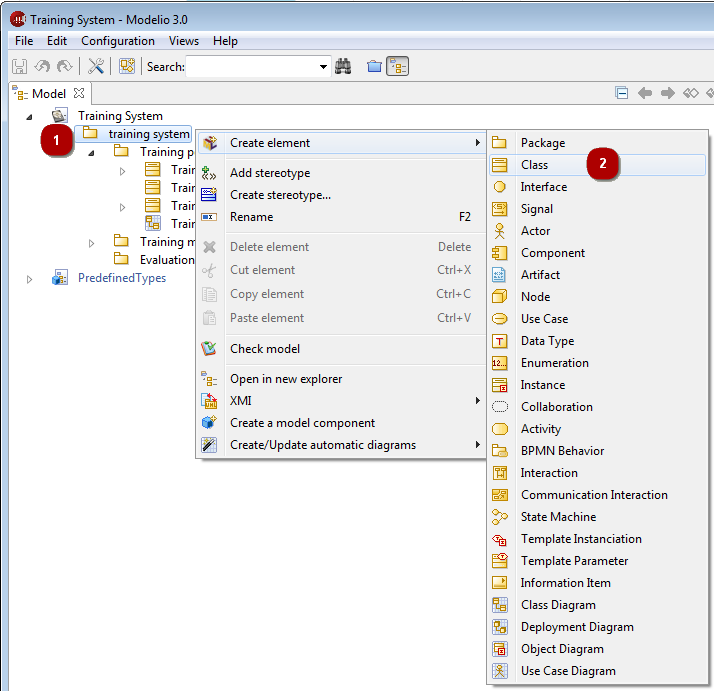

// Disable all captions for figures.
:!figure-caption:

[[Creating-elements-using-the-contextual-menu-commands]]

[[creating-elements-using-the-contextual-menu-commands]]
= Creating elements using the contextual menu commands

In the explorer and diagram edition views, you can create model elements using the "Create an element" command.

1.  Right-click on the element inside which you want to create your new element.
2.  In the "Create an element" contextual menu, select the type of element you want to create.

.Creating a class inside a class in the "Model" view

*Note:* The elements you can create vary according to what kind of element you have selected. Available elements are organized into groups of similar or related elements, so as to make it easier for you to find the element you want to create.

