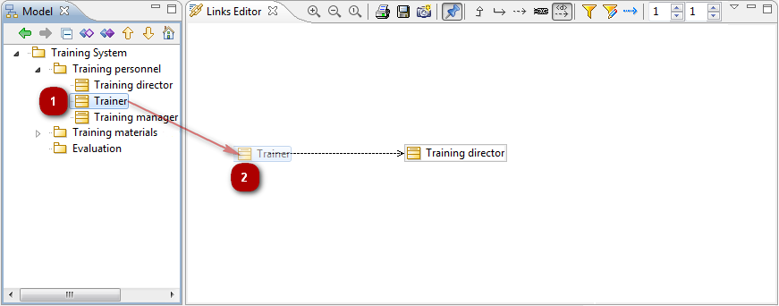

// Disable all captions for figures.
:!figure-caption:
// Path to the stylesheet files
:stylesdir: .

= Creating links using the links editor

Creating new links in your model using the links editor is very easy.

When the links editor is in "edit" mode (i.e. "pinned",using the pin button [image:images/Modeler-_modeler_building_models_creating_links_linkeditor_EditionMode.png[1]]), you can drag any element from another view (e.g. the <<Modeler-_modeler_interface_uml_view.adoc#,UML explorer view>>) and drop it into the links editor view to create a new link between the dropped element and the element represented by the central node. You can even drop several elements at the same time, provided they are all instances of the same metaclass. For example, you can drop several classes, or several packages at once, but not a class AND a package at the same time.

The orientation of the created link (whether it is from the central node's element to the dropped element or vice versa) is defined by the point at which you drop the element, with relation to the central node.

The links editor tries to determine the type of the created link based on the types of link visible at the time of the drop, and on the metaclass of both the dropped element and the central node element. If several types among those visible are valid, a dialog will open, asking you to choose the exact type to use for the creation.

=== Example

Let's say you want to add several traceability links between the requirements given by the client and your implementation classes.

First of all, you may want to switch to the <<Modeler-_modeler_interface_perspectives.adoc#TracePerspective,Trace perspective>> which organizes views in an optimal way for this kind of task, with the links editor view in the center and model explorers on both sides.

Next, you'll want to configure the links editor by carrying out the following two operations:

1. Set the links editor so that only dependencies are visible [image:images/Modeler-_modeler_building_models_creating_links_linkeditor_dependency.png[5]] and activate dependency filtering ([] checked).
2. Set the dependency filter to show only dependencies with a «trace» stereotype (to do this, click on the "Set dependencies filter" button [image:images/Modeler-_modeler_building_models_creating_links_linkeditor_EditFilter.png[7]] and make sure that the right column contains only the «trace» stereotype).

image::images/Modeler-_modeler_building_models_creating_links_linkeditor_DependencyFilterEdition.png[8]

From this point on, creation is fast and easy. Simply unpin the editor if previously pinned ([image:images/Modeler-_modeler_building_models_creating_links_linkeditor_EditionMode.png[1]] unchecked), and select an element in the model explorer. The selected element then becomes the central node. Continue by pinning the editor ([image:images/Modeler-_modeler_building_models_creating_links_linkeditor_EditionMode.png[1]] checked), and then dragging one or several classes into the links editor.

Rinse and repeat, fast and easy!

