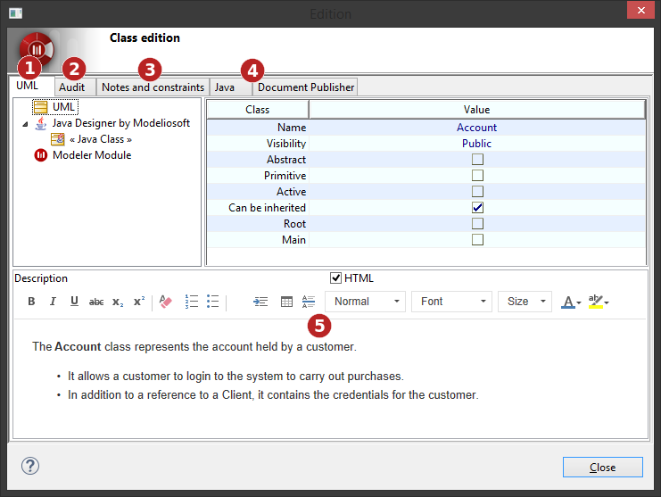
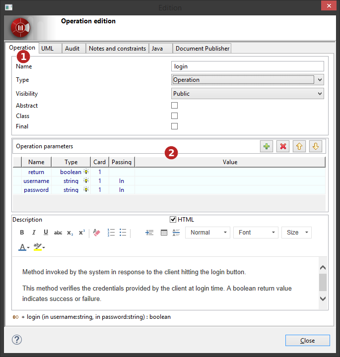

// Disable all captions for figures.
:!figure-caption:

[[Editing-elements-using-edition-boxes]]

[[editing-elements-using-edition-boxes]]
= Editing elements using edition boxes

Elements can be edited through an edition box by double-cliking on them, or by using the 'image:images/Modeler-_modeler_building_models_editing_elements_openproperties.png[1] Edit element...' contextual menu command.

.Generic edition box

*Keys:*

1. Properties tab, similar to the <<Modeler-_modeler_building_models_modifying_element_props.adoc#,Element view>>.
2. Audit tab, similar to the <<Modeler-_modeler_handy_tools_model_audit.adoc#,Check model window>>.
3. Notes and constraints tab, similar to the <<Modeler-_modeler_building_models_add_notes.adoc#,Notes and constraints view>>.
4. Modules tabs for each relevant module.
5. Quick "Description" note edition frame.

[[Noteworthy-edition-boxes]]

[[noteworthy-edition-boxes]]
== Noteworthy edition boxes

Some edition boxes are designed specifically for some elements:

[[Operations]]

[[operations]]
===== Operations

.Operation edition box

*Keys:*

1. Operation dedicated tab.
2. Parameters management frame.

[[Use-Case]]

[[use-case]]
===== Use Case

.Use Case edition box
image::images/Modeler-_modeler_building_models_editing_elements_EditUseCase_en.png[7]

*Keys:*

1. Use Case dedicated tab.
2. Use Case specific notes tabs.

