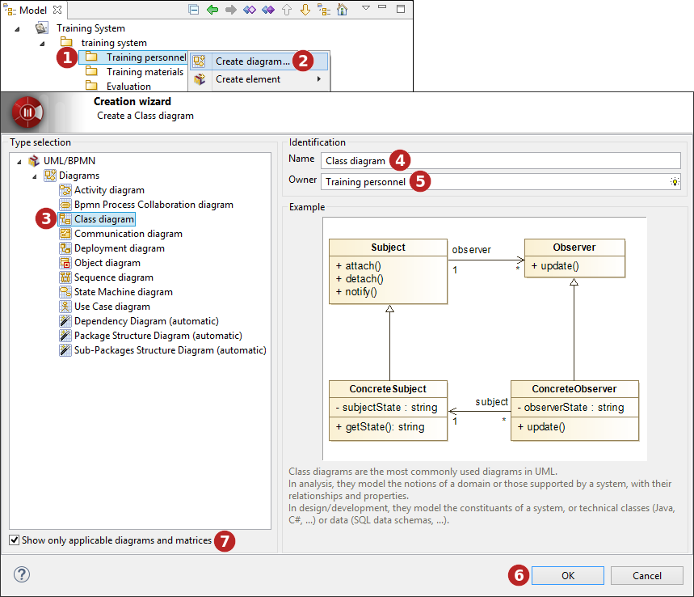

// Disable all captions for figures.
:!figure-caption:

[[Creating-a-diagram]]

[[creating-a-diagram]]
= Creating a diagram

[[How-do-I-create-a-diagram-in-Modelio]]

[[how-do-i-create-a-diagram-in-modelio]]
===== How do I create a diagram in Modelio?

* By using the *Create diagram...* command from the contextual menu.

[[Diagram-creation-wizard]]

[[diagram-creation-wizard]]
===== Diagram creation wizard

.Creating a class diagram using the Diagram creation wizard

*Keys:*

1. Select the element on which you want to create a diagram.
2. Click on the "image:images/Modeler-_modeler_diagrams_creating_diagram_diagramwizard.png[4] Create diagram..." button in the selected elements contextual menu.
3. Select a type of diagram.
4. Enter a name for the new diagram or leave the default name.
5. If the diagram owner is different from the selected model element, indicate the diagram owner.
6. Click on "OK" to complete the new diagram creation.
7. Non-applicable diagrams are greyed and can be masked by checking the "Show only applicable diagrams" tickbox.

[[Diagrams-supported-by-Modelio]]

[[diagrams-supported-by-modelio]]
===== Diagrams supported by Modelio

As standard, Modelio supports the following types of diagram:

* Class diagrams, which present an element's internal structure and its relationships with other elements.
* Composite structure diagrams, which show the internal structure of a class and the collaborations that this structure makes possible.
* Component diagrams, which represent the implementation perspective of a system.
* Deployment diagrams, which are used to represent the physical execution architecture of the system.
* Object diagrams, which depict instances and their relationships at a given point in time.
* Package diagrams, which show only packages and their dependencies, and which illustrate model element organization.
* Activity diagrams, used to graphically model activity graphs showing a procedure or workflow.
* Sequence diagrams, which show the modeling of sequential logic, illustrating how different objects cooperate.
* Communication diagrams, which show how different nodes cooperate, focusing on internal structure architecture and message passing.
* Interaction overview diagrams, which show orchestration logic using the usual activity diagram mechanisms.
* Use case diagrams, which show use cases, actors and transitions to describe the most important services rendered by the system.
* State diagrams, which describe the different states an object can be in, as well as the transitions between states.
* BPMN diagrams, which support business process modeling through activity flows associated with flow control elements.
* Composite structure diagrams, which depict the internal structure of a classifier, as well as the internal details of a collaboration.

Additional diagrams are provided by specific modules or features such as Analyst, TOGAF Architect, and so on.

