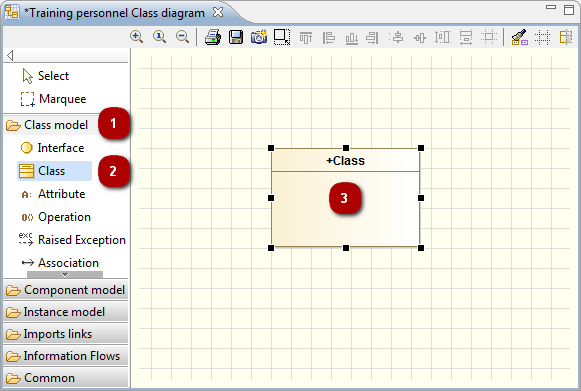

// Disable all captions for figures.
:!figure-caption:

[[Creating-elements-in-a-diagram]]

[[creating-elements-in-a-diagram]]
= Creating elements in a diagram

[[Introduction]]

[[introduction]]
===== Introduction

Modelio diagrams are built around two kinds of element:

* Box elements (for example, packages, classes, instances, ...)
* Links (for example, associations, inheritance links, dependencies, ...)

When an element is created in a diagram, the UML view is automatically updated to include the new element. Similarly, if an element is modified or deleted in a diagram, it is also modified or deleted in the UML view. This means that consistency is constantly maintained in all views.

[[Creating-elements-in-diagrams-using-the-icon-palette]]

[[creating-elements-in-diagrams-using-the-icon-palette]]
===== Creating elements in diagrams using the icon palette

In Modelio diagrams, box elements and links are created using the icons in the palette on the left of the diagram.

Elements are sorted in groups in the diagram palette. You can expand/shrink these groups by left-clicking on them, you can also Pin/Unpin these groups by left-clicking on the little 'pin' icon on the right of the group.

All Modelio diagrams include the model expert feature, which provides real-time assistance when you are creating elements in diagrams. If you try to create an unauthorized element (for example, if you try to create a package inside a class or an association between a package and a class), the model expert highlights the concerned element in red, indicating that the creation operation you are attempting is not allowed.

.Creating a class in a class diagram

*Steps:*

1. Left-click on the *'Class model'* group in the diagram palette in order to expand it.
2. Left-click on the *'Class'* icon in the diagram palette.
3. Left-click in the diagram where you want to create the class.

[[Resizing-a-new-element-during-creation]]

[[resizing-a-new-element-during-creation]]
===== Resizing a new element during creation

If you want to resize your new element while you are creating it, simply hold down the left mouse button when you click in the diagram, and drag the mouse until the element is as big as you want it to be.

[[Umasking-elements-using-the-drag-and-drop]]

[[umasking-elements-using-the-drag-and-drop]]
===== Umasking elements using the drag and drop

The drag and drop feature enables you to quickly unmask elements in Modelio diagrams simply by dragging them from the "Model" view into a diagram, as shown in the example below.

You can simultaneously drag and drop several elements into a diagram by just holding down the "Ctrl" key, selecting all the elements in question in the "Model" view, and then dragging and dropping them all into the diagram.

.Unmasking a class in a class diagram using the drag and drop feature
image::images/Modeler-_modeler_diagrams_creating_elements_DiagDragDrop.png[4]

[[Creating-several-elements-of-the-same-kind]]

[[creating-several-elements-of-the-same-kind]]
===== Creating several elements of the same kind

Very often, you need to create several different occurrences of the same kind of element, and for this Modelio provides the 'sibling' feature. To create several elements of the same type, simply create the first element in the diagram, then left-click on it while holding down the *'Ctrl'* key and drag it wherever you want to create another element of the same type. The element is created when you release the mouse button. This feature also works when several elements are selected.

