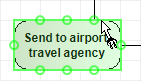
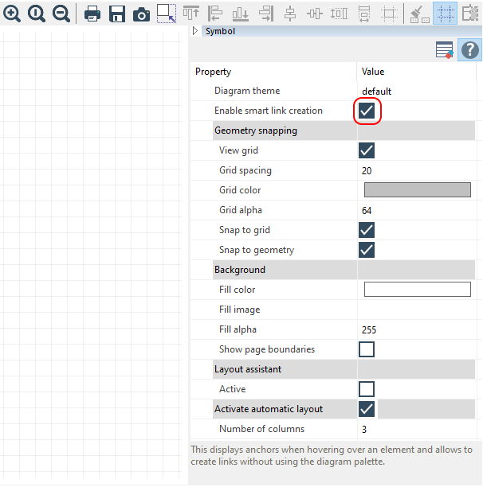

// Disable all captions for figures.
:!figure-caption:
// Path to the stylesheet files
:stylesdir: .

[[Drawing-links-in-a-diagram]]

[[drawing-links-in-a-diagram]]
= Drawing links in a diagram

[[Introduction]]

[[introduction]]
===== Introduction

In Modelio diagrams, there are four different ways of drawing links:

* The orthogonal mode, where a link contains one or more right angles
* The direct mode, where a link is presented as a straight line
* The bendpoint mode, where a link is presented in the manner of your choice
* The rake mode, where a link is presented in rake bar form

All Modelio diagrams include the model expert feature, which provides real-time assistance when you are creating links in diagrams. If you try to create an authorized element (in this example, an association between two classes), the model expert highlights the concerned element in green, indicating that the creation operation you are attempting is allowed. If you try to create an unauthorized link (for example, an association between a package and a class), the model expert highlights the concerned element in red, indicating that the creation operation you are attempting is not allowed.

[[Drawing-links-in-orthogonal-mode]]

[[drawing-links-in-orthogonal-mode]]
===== Drawing links in orthogonal mode

.Drawing an association between two classes in orthogonal mode (default mode)
image::images/Modeler-_modeler_diagrams_drawing_links_CreateLink.png[2]

*Steps:*

1.  Click on the "Create an association" icon in the diagram palette.
2.  Click on the origin class.
3.  Draw your link, with any desired routing points image:images/RoutingPoint.png[RoutingPoint], and then click on the destination class.

[[Drawing-links-in-bendpoint-mode]]

[[drawing-links-in-bendpoint-mode]]
===== Drawing links in bendpoint mode

.Drawing the same association but this time in bendpoint mode (using *Shift*)
image::images/Modeler-_modeler_diagrams_drawing_links_CreateBendLink.png[3]

*Steps:*

1.  Click on the "Create an association" icon in the diagram palette.
2.  Click on the origin class.
3.  Draw your link while holding down the *Shift* key, with any desired routings points, and then click on the destination class.

[[Drawing-links-in-rake-bar-mode-shared-target-links]]

[[drawing-links-in-rake-bar-mode-shared-target-links]]
===== Drawing links in rake-bar mode (shared target links)

Inheritance links linking more than two elements are automatically presented in rake-bar mode. Links in rake-bar mode can be drawn vertically, horizontally, pointing up or pointing down.

Additional elements can be added to the same rake bar link, simply by clicking on the link itself.

.Drawing an inheritance link in rake-bar mode
image::images/Modeler-_modeler_diagrams_drawing_links_CreateRakeLink.png[4]

*Steps:*

1. Click on the "Create a Generalization" icon in the diagram palette.
2. Click on the origin class.
3. Draw your link with any desired intermediate points, and then click on the already existing Generalization.

[[Fixed-anchors]]

[[fixed-anchors]]
===== Fixed anchors

Some elements (such as BPMN, State or ArchiMate elements) have fixed anchor points, which allow the links to be hooked there so that their origin/destination points do not change subsequently, when moving or resizing these elements. The number of fixed anchors depends on the size of the element.

.Fixed anchors on small State element
image::images/FixedAnchors.png[FixedAnchors]

.Fixed anchors on larger State element

[[The-Smart-links-tool]]

[[the-smart-links-tool]]
=== The Smart links tool

Modelio 3.6 introduces Smart Links, an easy-to-use powerful tool to create links in your diagrams. It can be used in two different ways.

*In the diagram palette*

.Drawing an association between two classes using the Smart links tool command in the diagram palette
image::images/Modeler-_modeler_diagrams_drawing_links_creating_link-type_elements_in_diagrams_2.png[5]

*Steps:*

1. Click on the "Smart links" command in the diagram palette
2. Click on the origin class
3. Click on the target class
4. Choose a link type from the list

*Using the mouse*

.Drawing an association between two classes using the Smart links tool
image::images/Modeler-_modeler_diagrams_drawing_links_creating_link-type_elements_in_diagrams_3.png[6]

*Steps:*

1. Move your mouse cursor over the origin class and wait for one second
2. When the anchors image:images/Modeler-_modeler_diagrams_drawing_links_SmartLinks_handle.png[8] appear, click on one of them and hold down your mouse button
3. Move your cursor over to the target class, as if to drag&drop the link's end onto it
4. Release the mouse button, then choose a link type from the list

*Note:* If you dont't want to display the anchors, you can deactivate them in the Symbol view of the diagram:

