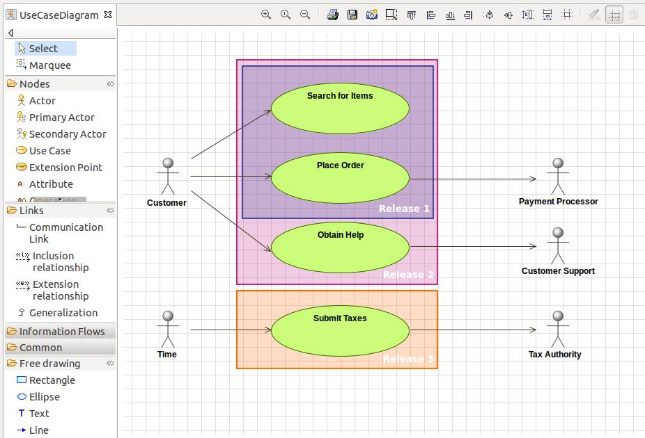
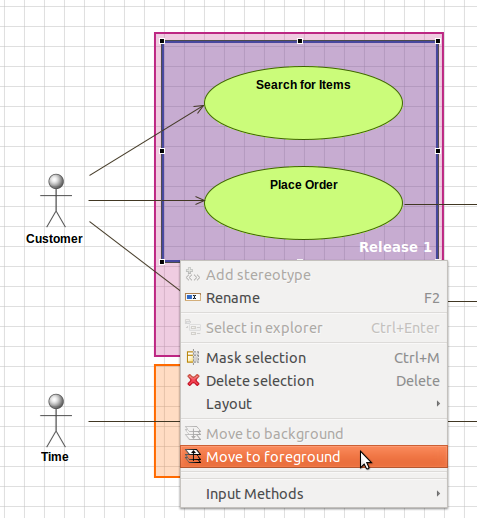

// Disable all captions for figures.
:!figure-caption:

[[Free-drawing]]

[[free-drawing]]
= Free drawing

[[Introduction]]

[[introduction]]
===== Introduction

Modelio 3.1 introduces a new free drawing feature to let you add pure-graphical information in your diagrams.

.A UseCase diagram emphasizing different zones with colored rectangles

[[Free-drawing-in-Modelio-diagrams]]

[[free-drawing-in-modelio-diagrams]]
===== Free drawing in Modelio diagrams

Use the diagram palette to add one of the available free drawing elements:

* Rectangle
* Ellipse
* Text field
* Line / Arrow

*Rectangles*

Select "Rectangle" in the palette, then click in the diagram background, draw a rectangle, and release the mouse button to validate the rectangle. Note: you can draw a perfect square by holding down the SHIFT key while drawing a rectangle.

*Ellipses*

Select "Ellipse" in the palette, then click in the diagram background, draw an ellipse, and release the mouse button to validate the ellipse. Note: you can draw a perfect circle by holding down the SHIFT key while drawing an ellipse.

*Text*

Select "Text" in the palette, then click in the diagram background to create a new text field.

*Lines (arrows)*

Select "Line" in the palette, click in the diagram background where you want the arrow to start (Line source), then click again where you want the arrow to stop (Line target). You can draw simple lines, one-direction arrows, or bi-directional arrows. Use the Symbol view to customize your lines.

[[Customization]]

[[customization]]
===== Customization

All the free drawing elements can be modified in the Symbol view (color, line width, background, font, line end, etc.)

[[Commands]]

[[commands]]
===== Commands

Free drawing elements can be moved to background or foreground:

*Steps:*

1.  Right-click on the border of a free drawing element
2.  Run the "Move to background" command to move the element in the background
3.  Run the "Move to foreground" command to move the element in the foreground again

