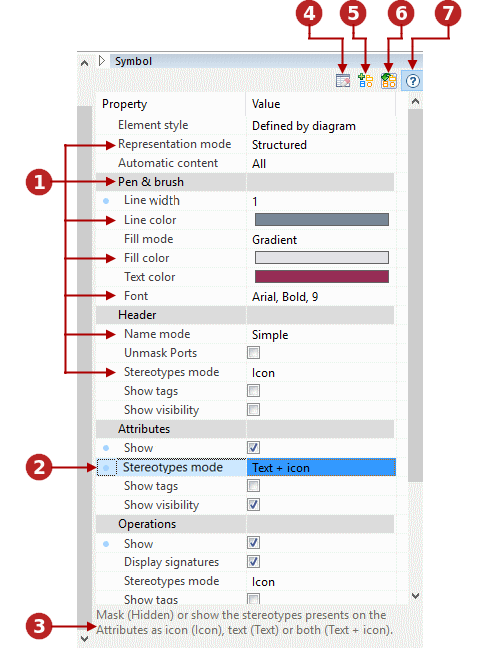

// Disable all captions for figures.
:!figure-caption:

[[Setting-graphic-options-for-diagrams]]

[[setting-graphic-options-for-diagrams]]
= Setting graphic options for diagrams

[[General-presentation]]

[[general-presentation]]
===== General presentation

The graphic properties of a diagram are listed in the Symbol view, which can be displayed in the diagram editor:

.Displaying the Symbol view
image::images/Modeler-_modeler_diagrams_graphic_options_Diag_GraphProp_001.gif[image]

*Steps:*

1. Open the Symbol view tray +
2. The Symbol view appears in the diagram editor. +

 

[[Detailed-presentation]]

[[detailed-presentation]]
===== Detailed presentation

.A close-up screenshot of the Symbol view

*Keys:* 

1. Graphic properties 
2. Edited graphic property (appears in bold)
3. Selected property description area
4. 'Cancel local changes' button
5. 'Create new style from local changes' button 
6. 'Update existing theme from local changes' button
7. 'Show/hide property description area' button 
 

[[Changing-The-graphic-properties-of-a-diagram-element]]

[[changing-the-graphic-properties-of-a-diagram-element]]
===== Changing The graphic properties of a diagram element

To change the graphic properties of a diagram element, you can either apply a new built-in style, or manually modify the properties one by one.

*Applying a built-in style* image:images/Modeler-_modeler_diagrams_graphic_options_Diag_GraphProp_004.png[image]

[[Applying-a-built-in-style-to-the-selected-element]]

[[applying-a-built-in-style-to-the-selected-element]]
Applying a built-in style to the selected element

*Steps:*

1. Select an element +
2. In the Symbol view, expand the 'Element style' drop down list +
3. Choose a style +
4. The style is applied to the selected element +
 

*Modifying graphic peoperties* 

[[Modifying-the-fill-color-of-the-selected-element]]

[[modifying-the-fill-color-of-the-selected-element]]
Modifying the fill color of the selected element

*Steps:*

1. Select an element +
2. In the Symbol view, click on the 'fill color' property +
3. Choose a color +
4. The fill color is applied to the selected element +

*Note:* Local changes can be cancelled by clicking on the "Cancel the local changes" button in the Symbol view toolbar image:images/Modeler-_modeler_diagrams_graphic_options_Diag_GraphProp_006.png[image]

[[Creating-your-own-diagram-element-style]]

[[creating-your-own-diagram-element-style]]
===== Creating your own diagram element style

Modelio lets you create your own diagram style. To create your own diagram style, simply carry out the steps shown in the <<Modeler-_modeler_modelio_settings_diagram_styles.adoc#,Diagrams styles>> section

