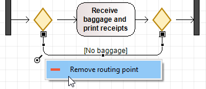
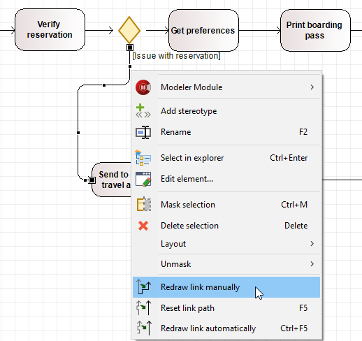
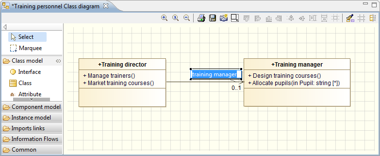

// Disable all captions for figures.
:!figure-caption:
// Path to the stylesheet files
:stylesdir: .

= Handling links

===== Moving a link or a part of a link

Simple links with no angles can be moved by clicking on the link, holding down the left mouse button, moving the link to the desired new position and releasing the mouse button.

For links with one or more angles, you can move each individual part of the link.

===== Moving a link end

To move a link end, simply left-click on the corresponding point which you wish to move, and drag it to the new position. When you release the left mouse button, the link end is repositioned.

*Note 1:* If you try to move a link end to an unauthorized position, the concerned element will be highlighted in red.

*Note 2:* Some elements (such as BPMN, State or ArchiMate elements) have fixed anchor points, which allow the links to be hooked there so that their origin/destination points do not change subsequently, when moving or resizing these elements. The number of fixed anchors depends on the size of the element.

===== Remove a routing point

To remove a routing point image:images/RoutingPoint.png[RoutingPoint], simply right-click on the corresponding point which you wish to remove, and click on "Remove routing point". The link will be automatically redrawn as short as possible between the upstream and downstream routing points.

.Remove a routing point

===== Redrawing a link

.Redraw links commands

====== Redrawing a link manually

If you want to redraw a link manually, right-click on the link to open the context menu and run the "Redraw link manually" command.

The graphic representation of the link then disappears, leaving you free to redraw the path of the link as you wish while keeping the same source and target.
Hold down the SHIFT key to change line path style.
 

====== Redrawing a link automatically

If you want to redraw a link automatically, you have two ways of activating the "Redraw link automatically" command:

* either select the link and press "CTRL-F5"
* or right-click on the link to open the context menu and run the "Redraw link automatically" command

The link is then completely redrawn to the shortest and its routings points are removed.  

*Note:* This command is available only on orthogonal links. 

====== Reseting a link path

If you want to reset the path of a link automatically, you have two ways of activating the "Reset link path" command:

* either select the link and press "F5"
* or right-click on the link to open the context menu and run the "Reset link path" command

The link is then redrawn to the shortest but its routings points and anchors are kept.

*Note:* This command is available only on orthogonal links. 

===== Modifying link values

If you want to enter or modify values for a link, you can do this directly in the diagram by pressing *F2* or double-clicking on a label.

.Directly entering a value for an association

Link values can also be entered or changed in the "Properties" view on the link.

