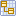
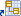

// Disable all captions for figures.
:!figure-caption:
// Path to the stylesheet files
:stylesdir: .

= Opening a diagram

There are 3 ways of opening a diagram :

1.  Double-click on its icon  in the "Model" view.
2.  Double-click on its icon  in the "Diagrams" view.
3.  Double-click on its shortcut icon  in a user folder in the "Diagrams" view.

*Note:* If the diagram is already open, its tab in the diagram edition view is brought to the foreground.

.Information on opening diagrams
image::images/Modeler-_modeler_diagrams_opening_diagram_OpenDiagram.png[image]

