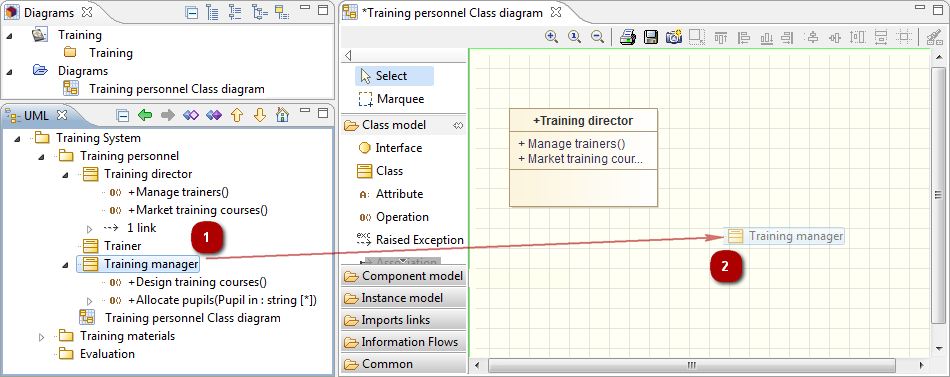
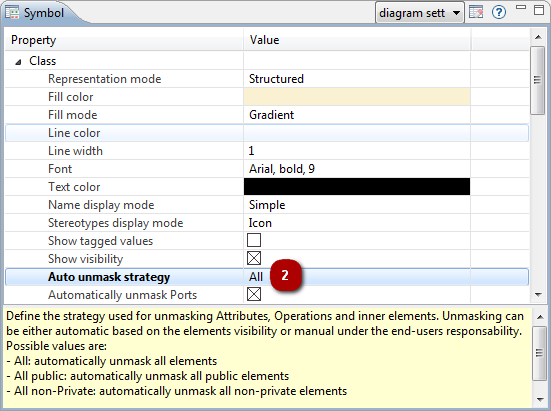
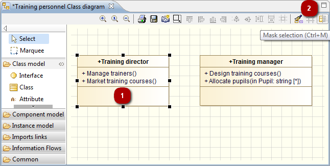

// Disable all captions for figures.
:!figure-caption:
// Path to the stylesheet files
:stylesdir: .

= Showing and masking elements in diagrams

===== Introduction

Diagrams can quickly become cluttered and consequently difficult to work with, if all model elements, their contents and associated links are visible. For this reason, Modelio lets you decide whether to show or mask diagram components and referenced elements.

Elements can be shown by:

* dragging and dropping them from the "Model" view into a diagram
* using the *"Unmask"* command in the context menu
* defining an automatic unmask policy in the *"Symbol"* view

Elements can be masked by:

* using the *"Ctrl+M"* shortcut in the diagram edition view
* using the *"Mask"* command in the context menu
* defining an automatic mask policy in the *"Symbol"* view

===== Showing using the drag and drop from the "Model" view

.Showing one class using the drag and drop

*Steps:*

1. Left-click on the element in the "Model" view.
2. Drag the element into the diagram and release the mouse button.

===== Showing using the "Unmask" command

.Showing a generalization between two classes
image::images/Modeler-_modeler_diagrams_showing_masking_elements_UnmaskMenu.png[3]

*Steps:*

1. Right-click on the element in the diagram edition view.
2. In the *Unmask* menu, click on the chosen command.

===== Showing using the Symbol view unmask policy property

*Steps:*

1. Right-click on the element in the diagram edition view.
2. In the "Symbol" view, edit the desired value field on the concerned element.

===== Showing all the internal elements of a class

The *"Symbol"* view on an element allows you to define an automatic unmask policy for its internal elements, according to their visibility:

* All: Show all elements
* All public: Show only public elements
* All non-private: Mask private elements
* Manual: Show or mask elements individually

===== Representation options

In Modelio diagrams, you can define a representation option for each and every diagram element in the *Symbol* view.

.Choosing to display the visibility on a class
image::images/Modeler-_modeler_diagrams_showing_masking_elements_SymbolVisibility.png[4]

*Steps:*

1. Edit the desired value field on the concerned element.

===== Masking an element

.Masking a class using the diagram edition view toolbar

*Steps:*

1. Left-click on the element in the diagram edition view.
2. Click on the *"Mask selection"* button of the diagram edition view toolbar.

