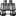
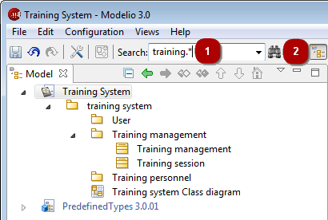
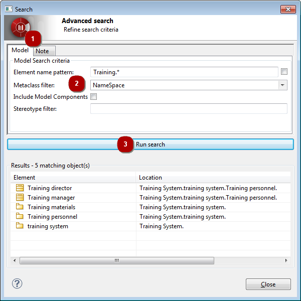
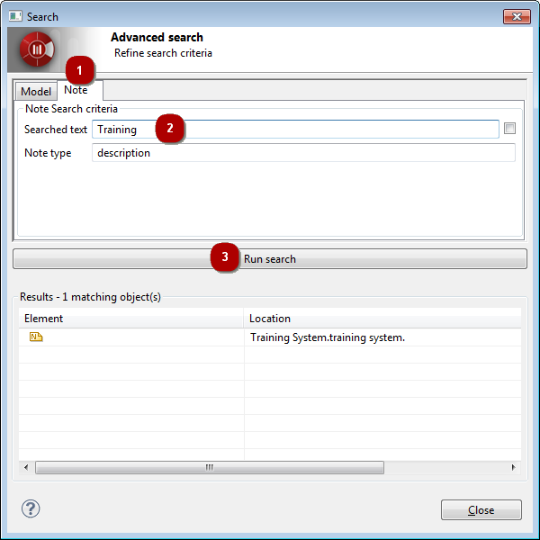

// Disable all captions for figures.
:!figure-caption:

[[Modelio-search-tool]]

[[modelio-search-tool]]
= Modelio search tool

[[Introducing-the-Modelio-search-tool]]

[[introducing-the-modelio-search-tool]]
===== Introducing the Modelio search tool

The Modelio search tool is used to quickly find NameSpace elements in a model, based simply on their name.

The Modelio search tool looks for namespaces (packages, classes, datatypes, ) based on the following criteria:

* Namespaces whose name exactly matches what is entered in the search field.
* Namespaces whose name corresponds to a regular expression (for example, "Training.*" will locate all namespaces starting with "Training").

You can run two types of search using the Modelio search tool:

* A *fast search*, run simply by entering what you want to search for in the search field and pressing enter. If there is only one matching element, it is selected in the browser and no additional dialog is popped. If there are zero or several matching elements, they are displayed in a dialog where you can further refine your search criteria.
* An *advanced search*, run by clicking on the  icon. This immediately opens a dialog in which you can define the criteria on which you want to base your search. When you run an advanced search, you can choose to search for elements in the model or for text in notes.

*Note:* The dialog which displays the results of a fast search is the same as the advanced search dialog. The only difference is how you access it.

[[Running-a-fast-search]]

[[running-a-fast-search]]
===== Running a fast search

*Steps:*

1. Enter the element name pattern that you want to search for and press enter.
2. Click on the  icon to open the advanced search panel.

If you click on the arrow on the right of the fast search field, a list of the searches you have already carried out is displayed. You can browse this list using the up/down keys on your keyboard or using your mouse. To select an element to search for from this list, just click on it to make it appear in the field and then press "Enter".

[[Running-an-advanced-search-in-a-model]]

[[running-an-advanced-search-in-a-model]]
===== Running an advanced search in a model

*Steps:*

1. In the "Search" dialog, click on the "Model" tab.
2. Complete the relevant fields, as follows:
* In the *Element name pattern* field, enter the name or expression you want to search for. The tickbox on the right of this field is used to specify whether or not you want your search to be case sensitive. By default, the search is not case sensitive.
* In the *Metaclass filter* field, select the metaclass of the type of element you want to search for.
* Check or uncheck the *Include model components* tickbox, according to your preference.
* In the *Stereotype filter* field, enter the name of the stereotype you want to use as a filter. Only elements stereotyped by the stereotype entered will then appear in the search results.
3. Click on the *Run search* button to launch the search.

[[Selecting-a-search-result-element-in-the-Model-view]]

[[selecting-a-search-result-element-in-the-model-view]]
===== Selecting a search result element in the "Model" view

You can select a search result element in the "Model" view simply by double-clicking on it in the search results window.

[[Running-an-advanced-search-in-notes]]

[[running-an-advanced-search-in-notes]]
===== Running an advanced search in notes

*Steps:*

1. In the "Search" dialog, click on the "Note" tab.
2. Enter the text that you want to search for, and the type of note in which you want to search.
3. Run the search.

