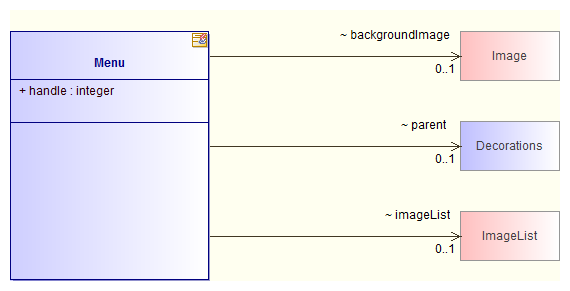

// Disable all captions for figures.
:!figure-caption:

= Class structure diagrams

The aim of this automatic diagram is to show how a class is made, what it consists of, what it inherits from and what embarks it.

=== Applicable elements

Class structure diagrams can be created on any Classifier.

=== Contents

* Class C itself.
* The public attributes of C.
* The classes to which C has an association.
* C's parent class if this exists.
* The interfaces implemented by C if these exist.
* The classes which have composition or aggregation associations to .

=== Layout

* Class C is positioned in the center of the diagram.
* The classes linked to C through associations leaving from C:
** are placed to the right of C.
** are viewed in "simple" mode.
** are exactly the same size and are aligned vertically.
* The classes linked to C through compositions or aggregations arriving in C:
** are placed to the left of C.
** are viewed in "simple" mode.
** are exactly the same size and are aligned vertically.
* C's parent classes and interface:
** are placed above C.
** are viewed in "simple" mode.
** are exactly the same size and are aligned horizontally.
* Auto-associations are placed below and to the right of C.
* All associations (other than auto-associations) are represented horizontally by a single straight line (no bends), and are regularly spaced vertically.
* Class C is resized vertically to cover all the associations.

*Note:* All elements present in this diagram have a specific associated <<Modeler-_modeler_handy_tools_automatic_diagrams_auto_diagrams_styles.adoc#,style>>.

=== Example

