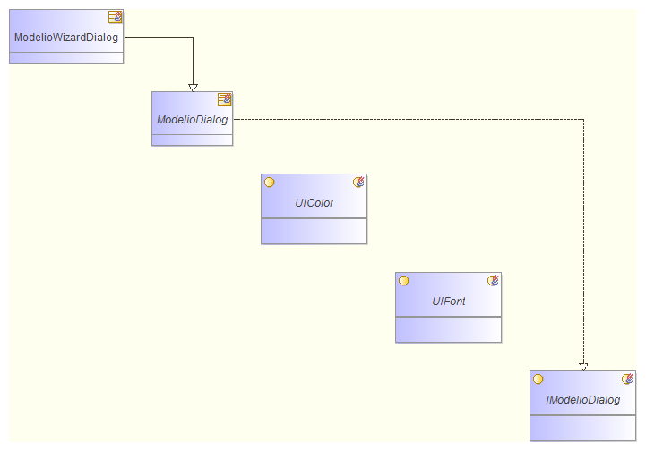

// Disable all captions for figures.
:!figure-caption:

= Package structure diagrams

The aim of this automatic diagram is to show the direct internal structure of a package, in other words the contents of the package, and the links between the package's elements. It is often these links which establish the package's encapsulation function.

== Applicable elements

Package structure diagrams can be created on any Package.

== Contents

* Package P itself is not visible. It is the context of the diagram.
* The classes contained in P are viewed.
* The associations and inheritance links between P's classes (and only between these classes, since elements not belonging to P are not unmasked).

== Layout

* Elements are laid out diagonally.

*Note:* All elements present in this diagram have a specific associated <<Modeler-_modeler_handy_tools_automatic_diagrams_auto_diagrams_styles.adoc#,style>>.

== Example

