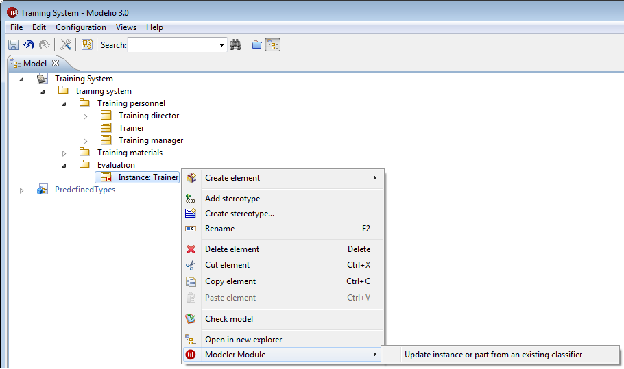

// Disable all captions for figures.
:!figure-caption:
// Path to the stylesheet files
:stylesdir: .

[[Modeling-assistants]]

[[modeling-assistants]]
= Modeling assistants

[[Introduction]]

[[introduction]]
===== Introduction

Modeling assistants enable you to significantly improve productivity, coherence and traceability, by creating elements from other elements through deduction.

For example, from an object present in a sequence diagram, you can create a class whose operations will be deduced directly from the messages received by the object.

Modeling assistants are run from the "Modeler Module" item in the context menus available on certain elements in the "Model" view and Modelio diagrams.

.Example of modeling assistant command on an Instance

[[assistants-available]]

[[assistants-available]]
===== assistants available

The following list shows which Modeling assistants are available on which model elements.

*Instance*:

* *Create a classifier from this instance*: Creation of a classifier and its contents from the instance and the received operations. If the instance has ports, the element created can be a class or a component. Otherwise, it can also be an interface or a node.
* *Update instance or part from the classifier*: Updates the ports and attribute links of the instance with regard to the instanciated classifier. If the instance is not linked to a classifier, it is possible to choose an existing classifier in the same package as the instance.

*Lifeline*:

* *Create a classifier from this instance*: Applies the assistant described above to the instance represented by the lifeline. The instance is also created if it does not already exist.
* *Update instance or part from the classifier*: Applies the assistant described above to the instance represented by the lifeline. The instance is also created if it does not already exist.

*Message*:

* *Create an operation from this message*: Creation of an operation from a message. If the class did not already exist, it is also created.

*Attribute link*:

* *Create an attribute from this occurrence*: Creation of an attribute from an attribute link. If the class did not already exist, it is also created.

*Transition*:

* *Create an operation from this transition*: Creation of an operation from the transition. This assistant can only be used in state diagrams associated with classes.

*Interface*:

* *Update classes from this interface*: Updates all classes implementing the interface from the interfaces content.

*Class*:

* *Implement Interfaces properties*: Creation of the operations defined in the interfaces that are implemented by the selected class.
* *Delete Interface properties implementations*:Deletion of the operations defined in the interfaces which are implemented by the selected class.
* *Update internal structure*: Update of the parts instantiated in the internal structure of the class.

