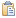
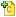
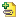

// Disable all captions for figures.
:!figure-caption:
// Path to the stylesheet files
:stylesdir: .

= The Notes & Constraints view

.The notes & constraints view
image::images/Modeler-_modeler_interface_annot_view_NotesAndConstraints.png[image]

*Keys:*

1. The "Notes & constraints" tab.
2. The "Notes & constraints" toolbar.
3. A rich note.
4. A note.
5. A constraint.
6. Note & constraint editing zone.

[[Main-notes-amp-constraints-view-commands]]

[[main-notes-constraints-view-commands]]
===== Main notes & constraints view commands

*From the Notes & Constraints contextual menu:*

* *Remove* [image:images/Modeler-_modeler_interface_annot_view_delete.png[3] – Delete / *Del* key] : Removes the Note/Constraint from the selected element.
* *Cut* [image:images/Modeler-_modeler_interface_annot_view_cut_16.png[4] – Cut / *Ctrl+X* key] : Cuts the Note/Constraint from the selected element.
* *Copy* [image:images/Modeler-_modeler_interface_annot_view_copy_16.png[5] – Copy / *Ctrl+C* key] : Copies the Note/Constraint from the selected element.
* *Paste* [ – Paste / *Ctrl+V* key] : Pastes the Note/Constraint to the selected element.

*From the Notes & Constraints toolbar:*

* *Add Constraint(s)* [] : Opens the "Add constraint" window, in which you can select the constraint(s) you want to add to the selected element and then display their content in the entry/modification zone.
* *Add Note* [] : Opens the "Add note" window, in which you can select the note(s) you want to add to the selected element and then display their content in the note entry/modification zone.
* *Add Description* [image:images/Modeler-_modeler_interface_annot_view_description.png[7]] : Directly adds a Description note to the selected element and then displays its content in the note entry/modification zone.
* *Add Rich Note* [image:images/Modeler-_modeler_interface_annot_view_addExternDocument_16.png[9] – Add Rich Note...] : Opens the "Create a Rich Note" window, in which you can define the name, role, MIME format and Abstract of the Rich Note you want to add to the selected element and then open the corresponding editor.
* *Remove* [image:images/Modeler-_modeler_interface_annot_view_delete.png[3] / *Del* key] : Removes the Note/Constraint from the selected element.
* *Clean Note/Constraint* [image:images/Modeler-_modeler_interface_annot_view_clean_note.gif[11]] : Deletes the contents of the selected note or constraint, but not the actual note or constraint itself.
* *Move up* [image:images/Modeler-_modeler_interface_annot_view_up_16.png[12]] : Moves the selected element up in the model structure.
* *Move down* [image:images/Modeler-_modeler_interface_annot_view_down_16.png[13]] : Moves the selected element down in the model structure.

*Note:* For more information, see "<<Modeler-_modeler_building_models_add_notes.adoc#,Adding notes to elements>>" and "<<Modeler-_modeler_building_models_add_richnotes.adoc#,Adding rich notes to elements>>".

