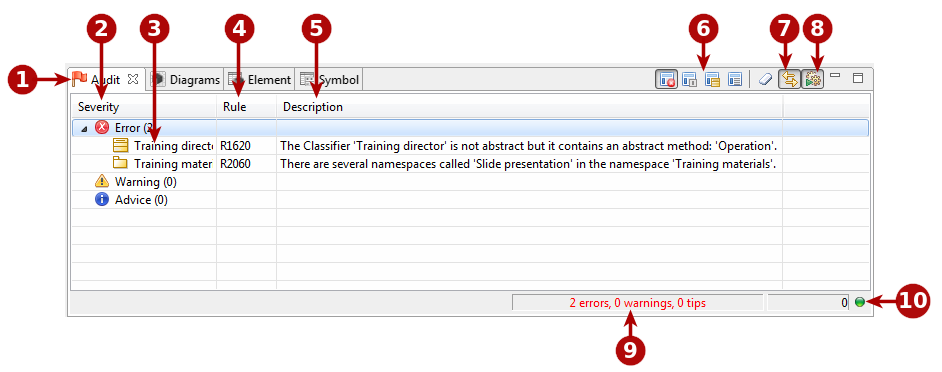

// Disable all captions for figures.
:!figure-caption:
// Path to the stylesheet files
:stylesdir: .

= Audit view

.The Audit view

*Keys:*

1. The "Audit" tab. The flag on the left of this tab changes color according to the most serious violation detected.
* Green: No violations detected.
* Blue: The most serious violation detected is an advice-level violation.
* Yellow: The most serious violation detected is a warning-level violation.
* Red: The most serious violation detected is an error-level violation.
2. Audit rule severity. There are three different severity levels:
* Advice: Simple information message.
* Warning: You can choose to take this information into account or not.
* Error: The error must be corrected.
3. Main element concerned.
4. Audit rule number.
5. Description of the problem.
6. Audit rule sorting options.
7. Auto-select of the concerned element in the model explorer.
8. The Audit running mode button.
9. Current Audit summary. This indicates how many error, warning and advice violations currently are open for a session.
10. Audit status. A green light indicates that the audit is not currently running, while a red light indicates that the audit is currently running.

===== Main audit view commands

*From the audit view toolbar:*

* *Group by severity* [] : Presents audit rule violations by severity (error, warning, advice).
* *Group by rule* [image:images/Modeler-_modeler_interface_audit_view_LayoutByRule.png[7]] : Presents audit rule violations by rule, in other words, shows all violations of each individual rule.
* *Group by concerned element* [image:images/Modeler-_modeler_interface_audit_view_LayoutByElement.png[6]] : Presents audit rule violations by concerned element, in other words, shows all problems concerning each individual element.
* *Flat view* [image:images/Modeler-_modeler_interface_audit_view_LayoutFlat.png[9]] : Shows audit rule violations simply in the order in which they are detected.
* *Clear audit view* [] : Clear the contents of the audit view.
* *Auto-select of the concerned element in the model explorer* [] : When this button is active, the model explorer "follows" your selections in the audit view, automatically selecting the concerned element in the model browser.
* *Audit running mode* [image:images/Modeler-_modeler_interface_audit_view_auto.png[3]] : When this button is pressed, the automatic audit running mode is selected. Otherwise, the manual mode is selected. In automatic mode, the audit will automatically check each modification carried out in the model. In manual mode, checks are only performed on demand, by running the "Check model" command on a model element (from the context menu opened by right-clicking on a model element). Note that in manual mode, the "Check model" command only checks the selected element and not the whole model.

*From the audit view context menu:*

* *Select in explorer* : This command is used to select the element concerned by the audit rule violation in the model explorer. This command is only useful when the "Auto-select of the concerned element in the model explorer" has been deactivated using the [] button in the audit view toolbar.
* *Show details* : This command opens a report dialog on the audit rule concerned. For more information, see the *Audit report dialog* paragraph below.
* *Change severity* : The three "Change severity" commands ("Change severity to advice", "Change severity to warning" and "Change severity to error") enable you to change the severity of the selected audit rule.
* *Disable rule* : This command is used to deactivate the selected rule. The rule in question will no longer be run. If you subsequently decide you want to reactivate the rule, this can be done in the "Audit configurator".

===== The "Audit report" dialog

.The Audit report dialog
image::images/Modeler-_modeler_interface_audit_view_Audit_error.png[16]

*Keys:*

* The *Reported issue* field provides a reminder of the audit rule violation.
* The *Linked elements* field provides information on any other elements which are involved in the audit rule violation. This is the case, for example, for dependency cycles, where the dialog will display all the elements involved in the cycle.
* The *Information zone* displays further information on the problem, and provides advice on how to fix it.

