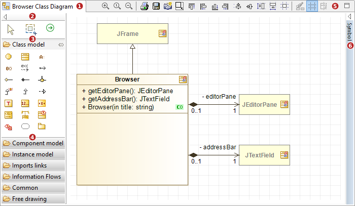
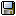

// Disable all captions for figures.
:!figure-caption:
// Path to the stylesheet files
:stylesdir: .

= The diagrams edition view

.The diagram edition view

*Keys:*

1. Name of the diagram.
2. Diagram palette.
3. Extended palette icon group.
4. Reduced palette icon group.
5. Diagram toolbar.
6. Reduced <<Modeler-_modeler_interface_symbol_view.adoc#,Symbol view>>.

[[Main-diagram-edition-view-commands]]

[[main-diagram-edition-view-commands]]
===== Main diagram edition view commands

*From the diagram palette:*

* *Create element* [Palette icon of your choice] : Creates the element corresponding to the selected palette icon in the diagram.

*From the diagram toolbar:*

* *Mask* [] : Masks the selected element(s).
* *Show/Hide grid* [image:images/Modeler-_modeler_interface_edition_view_grid.png[4]] : Shows or hides the grid in the diagram, making it easier to align elements.
* *Clone graphic options* [image:images/Modeler-_modeler_interface_edition_view_clone_graphic_options.gif[5]] : Clones the graphic options defined for a selected element in order to apply them to another element in the diagram.
* *Align elements* [image:images/Modeler-_modeler_interface_edition_view_align.gif[6]] : Alignment tools, in which you can choose how you want to align selected elements.
* *Auto size* [image:images/Modeler-_modeler_interface_edition_view_auto_size.png[7]] : Automatically resizes the selected element(s).
* *Copy the diagram as a graphic* [image:images/Modeler-_modeler_interface_edition_view_copy_image.png[8]] : Copies the contents of the diagram to the clipboard.
* *Save the diagram in a file* [] : Opens the "Save as" window, in which you can configure the saving of your diagram in a file.
* *Print the diagram* [image:images/Modeler-_modeler_interface_edition_view_print.png[10]] : Prints the content of the diagram.
* *Zoom out* [image:images/Modeler-_modeler_interface_edition_view_zoom_out.png[11]] : Zooms out.
* *Zoom to 1:1* [image:images/Modeler-_modeler_interface_edition_view_zoom_to_default.png[12]] : Switches to 1:1 scale.
* *Zoom in* [image:images/Modeler-_modeler_interface_edition_view_zoom_in.png[13]] : Zooms in.

*From the diagram contextual menu:*

* *Create element* [image:images/Modeler-_modeler_interface_edition_view_createuml.png[14] – Create element] : Creates the element of your choice in the selected element.
* *Add stereotype(s) on an element* [image:images/Modeler-_modeler_interface_edition_view_addStereotype_16.png[15] – Add stereotype(s)...] : Adds one or several stereotypes to the selected element.
* *Rename* [image:images/Modeler-_modeler_interface_edition_view_rename.png[20] – Rename / *F2* key] : Edits the selected element name.
* *Select in explorer* [image:images/Modeler-_modeler_interface_edition_view_select.png[16] – Select in explorer / *Ctrl-Enter* key] : Selects the element in the "Model" view.
* *Edit element...* [image:images/Modeler-_modeler_interface_edition_view_openproperties.png[21] – Edit element...] : Open the <<Modeler-_modeler_building_models_editing_elements.adoc#,edition box>> of the selected element.
* *Mask an element* [ – Mask selection / *Ctrl-M* key] : Masks the element(s).
* *Delete an element* [image:images/Modeler-_modeler_interface_edition_view_delete_16.png[18] – Delete selection / *Del* key] : Deletes the selected element(s).
* *Unmask* [Unmask] : Unmasks the element(s) of your choice.

*Note:* For more information, see "<<Modeler-_modeler_diagrams_creating_elements.adoc#,Creating elements in a diagram>>" and more generally the "Modelio diagrams" chapter.

