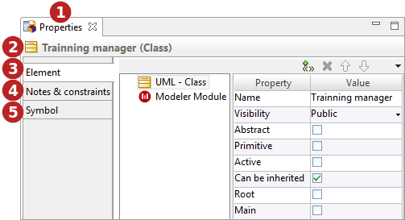

// Disable all captions for figures.
:!figure-caption:
// Path to the stylesheet files
:stylesdir: .

= The Properties view

The *Properties* view is a combined view aggregating the *<<Modeler-_modeler_interface_uml_prop_view.adoc#,Element>>*, *<<Modeler-_modeler_interface_annot_view.adoc#,Notes & constraints>>* and *<<Modeler-_modeler_interface_symbol_view.adoc#,Symbol>>* views.

.The Properties view

*Keys:*

1. *"Properties"* view tab.
2. Selected element's name and metaclass.
3. "<<Modeler-_modeler_interface_uml_prop_view.adoc#,Element>>" tab.
4. "<<Modeler-_modeler_interface_annot_view.adoc#,Notes & constraints>>" tab.
5. "<<Modeler-_modeler_interface_symbol_view.adoc#,Symbol>>" tab.

