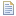

// Disable all captions for figures.
:!figure-caption:

= The script view

.The script view
image::images/Modeler-_modeler_interface_script_view_ScriptTab.png[image]

*Keys:*

1. The "Script" view tab.
2. The "Script" view toolbar.
3. The script input zone.
4. The script output zone.

[[Main-script-view-commands]]

[[main-script-view-commands]]
===== Main script view commands

* *Open Macros catalog* [] : Opens the Macros catalog.
* *Load a script* [] : Loads an existing script.
* *Load and run a script* [] : Loads an existing script and automatically runs it.
* *Save a script* [image:images/Modeler-_modeler_interface_script_view_save_16.png[7]] : Saves the script entered in the script input zone.
* *Clear the output zone* [image:images/Modeler-_modeler_interface_script_view_clearoutput_16.png[4]] : Clears the entire contents of the script view output zone.
* *Activate script debug mode* [] : Activates the script debug mode. In this mode, the script input zone is not cleared when a script is run.
* *Run a script* [image:images/Modeler-_modeler_interface_script_view_go_16.png[3]] : Runs the script entered in the script input zone and displays the result in the script output zone.

*Note:* For more information, see "<<Modeler-_modeler_handy_tools_scripts_macros.adoc#,Scripts and macros>>".

