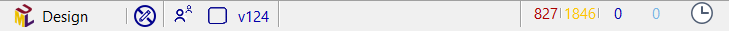
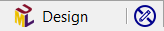
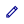
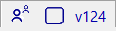
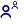
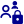
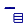
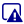
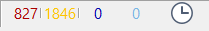

// Disable all captions for figures.
:!figure-caption:
// Path to the stylesheet files
:stylesdir: .

= The status bar

The status bar displays a quick summary of various aspects of the application.

===== Element status

. Main icon of the selected element
. Name of the selected element
. Editability of the selected element:
*  The element can be edited freely.
* image:images/Modeler-_modeler_interface_status_bar_ro-element.png[ro] The element cannot be modified.

===== SVN status

. Lock status in the repository:
*  The element is currently not locked.
*  The element is locked by the logged user.
*  The element is currently locked by another user.
*  The element is not versionned.
. Status of the element relatively to the repository:
*  The element is still unchanged.
*  The element has been locally modified.
*  The element is soon to be added to the repository.
*  The element is soon to be removed from the repository.
*  The element has been modified in the repository, a model update is potentially needed.
*  The element is in conflict mode: it has been modified locally and on the repository. Use the SVN conflict resolution to fix it.
. Revision number in the repository

===== Audit status

Summary of the audit status in the project.

. This indicates how many error, warning and advice have been reported in the project. Open the <<Modeler-_modeler_interface_audit_view.adoc#,audit view>> to see them.
. Number of tests remaining to be processed, after the model has changed.
. Whether or not the audit is running
