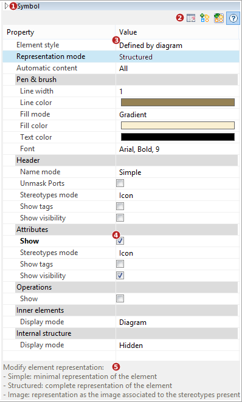

// Disable all captions for figures.
:!figure-caption:

= The Symbol view

.The Symbol view

*Keys:*

1. The show/hide "Symbol" view button.
2. The "Symbol" view toolbar.
3. Properties of the main element.
4. Properties of sub-elements.
5. Help field.

*Note:* For more details, see "<<Modeler-_modeler_diagrams_graphic_options.adoc#,Setting graphic options in diagrams>>".

