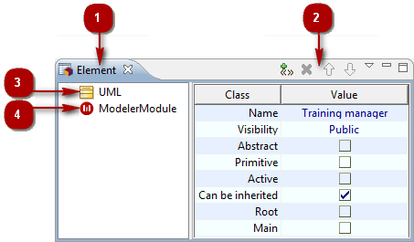
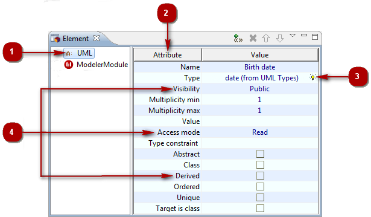
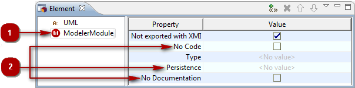

// Disable all captions for figures.
:!figure-caption:
// Path to the stylesheet files
:stylesdir: .

= The Element view

.The Element view

*Keys:*

1. The "Element" view tab.
2. The "Element" view toolbar.
3. The "UML" group.
4. The "Modeler Module" group.

=== Stereotypes

*From the Element contextual menu:*

* *Add stereotype* [image:images/Modeler-_modeler_interface_uml_prop_view_addStereotype_16.png[3] – Add stereotype(s)...] : Opens the "Add stereotype" window, in which you can select the stereotype(s) you want to add to the selected element.
* *Remove* [image:images/Modeler-_modeler_interface_uml_prop_view_delete.png[8] – Delete / *Del* key] : Removes the stereotype from the selected element.
* *Cut* [image:images/Modeler-_modeler_interface_uml_prop_view_cut_16.png[16] – Cut / *Ctrl+X* key] : Cuts the stereotype from the selected element.
* *Copy* [image:images/Modeler-_modeler_interface_uml_prop_view_copy_16.png[17] – Copy / *Ctrl+C* key] : Copies the stereotype from the selected element.
* *Paste* [image:images/Modeler-_modeler_interface_uml_prop_view_paste_16.png[18] – Paste / *Ctrl+V* key] : Pastes the stereotype to the selected element.

*From the Element toolbar:*

* *Add stereotype* [image:images/Modeler-_modeler_interface_uml_prop_view_addStereotype_16.png[3]] : Opens the "Add stereotype" window, in which you can select the stereotype(s) you want to add to the selected element.
* *Remove* [image:images/Modeler-_modeler_interface_uml_prop_view_delete.png[8] / *Del* key] : Removes the stereotype from the selected element.
* *Move up* [image:images/Modeler-_modeler_interface_uml_prop_view_up_16.png[11]] : Moves the selected stereotype up.
* *Move down* [image:images/Modeler-_modeler_interface_uml_prop_view_down_16.png[12]] : Moves the selected stereotype down.

*Note:* For more information, see "<<Modeler-_modeler_building_models_add_stereotypes.adoc#,Adding stereotypes to elements>>".

=== UML Group

.The "UML" group of the "Element" view

*Keys:*

1. "UML" group.
2. Type of the selected element.
3. "Picking" field.
4. UML properties of the element.

*From the "Value" cell of the property of your choice:*

* *Enter/Modify a simple property* [Left-click] : Makes the "Value" field of the property active, enabling you to enter or modify information in it.
* *Enter/Modify a 'picking' property (image:images/Modeler-_modeler_interface_uml_prop_view_indicator.png[4])* [Left-click] : Makes the 'picking' functionality active, enabling you to pick an element in the explorers or diagrams in order to fill the field.
+
You can also use the [*Ctrl-Space*] short-cut to display a drop-down list of the elements available for this field.

*Note:* For more information, see "<<Modeler-_modeler_building_models_modifying_element_props.adoc#,Modifying an element's properties>>".

=== Modeler Module Group

.The "Modeler Module" group of the "Element" view

*Keys:*

1. "Modeler Module" group.
2. Tagged values.

*From the Tagged Value fields:*

* *Add/Remove a tagged value which has no parameters* [Right-click on the tickbox] : Adds the tagged value in question to the selected element. To remove the tagged value from the selected element, just uncheck the tickbox.
* *Add/Remove a tagged value which has one parameter* [Right-click on the field] : Activates the "Value" field, enabling you to directly enter the value of the tagged value parameter. Once a value has been defined, the tagged value is added to the selected element. To remove the tagged value from the selected element, just activate the "Value" field and remove the defined parameter value. The tagged value is then removed from the selected element.
* *Add a tagged value which can have several parameters* [Right-click on the field] : Opens the "Edit tagged value parameters" window, in which you can define and add parameters to the tagged value. Once one or several values have been defined, the tagged value is added to the selected element. To remove the tagged value from the selected element, just click in the "Value" field to open the "Edit tagged value parameters" window and remove all the parameters. The tagged value is then removed from the selected element.

*Note:* For more information, see "<<Modeler-_modeler_building_models_add_tv.adoc#,Adding tagged values to elements>>".

