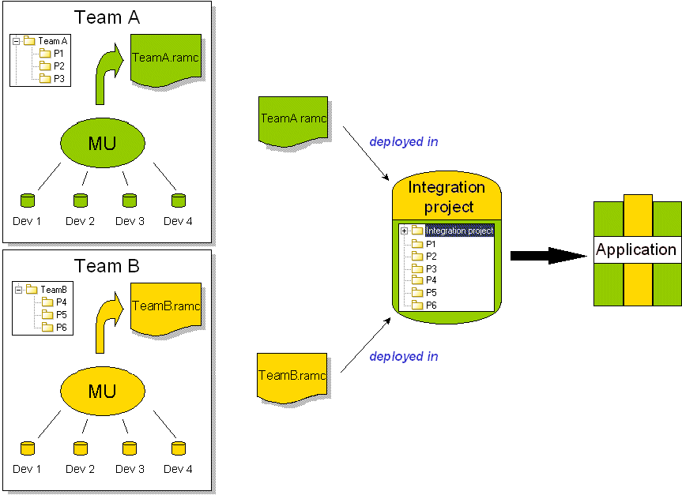

// Disable all captions for figures.
:!figure-caption:
// Path to the stylesheet files
:stylesdir: .

= Introducing model components

=== What are model components?

Model components are independent, identified and coherent parts of a larger model, packaged into a single file.

Model components can contain the following:

* stable model extracts
* tagged value and note types specific to certain modules
* external files

Sometimes referred to as RAM components (Reusable Autonomous Model components), model components are used in a teamwork context, to allow

different developers or development teams working on the same project to work only on a limited part of the complete project model.

Model components have a <<Modeler-_modeler_local_libraries_model_components_lifecycle.adoc#,version number>>. At regular, identified intervals, each model component can be repackaged and its version number incremented, before being delivered to an integration project, where the complete application will be assembled.

Since it is impossible to completely isolate one part of a development project from all the others, a model component can depend on another model component. For further information on model component dependencies, please see "<<Modeler-_modeler_local_libraries_model_components_lifecycle.adoc#,The life cycle of a model component>>".

=== What are the benefits of using model components?

In a large scale multi-user development project, with several people working together at the same time and in the same workspace, it can be challenging, not to say difficult, to efficiently manage all the interactions that take place.

Model components enable you to increase your efficiency, by reducing the size of the different model extracts involved in a project, and the number of people working on any given model part. This means that each development team can progress in its own teamwork environment and according to its own schedule, without affecting the work of the other project participants (as shown below).

.Using model components

