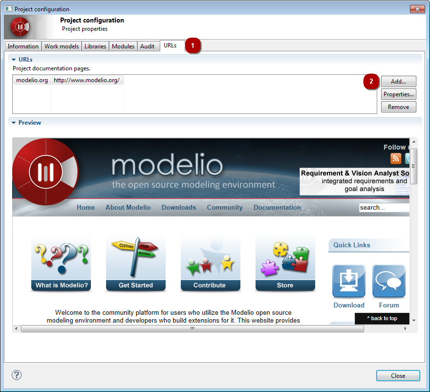
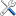

// Disable all captions for figures.
:!figure-caption:
// Path to the stylesheet files
:stylesdir: .

= Configuring project URLs

In Modelio, custom information pages can be associated with each project. +
These pages are displayed in the _workspace view_ as additional tabs.

Project custom pages can be used, for example, to display the project's documentation, the list of anomalies to correct, the planning schedule, the state of builds or, more generally, any other information that may be useful to the developer.

Project custom pages are configured in the *URL* tab of the *Project Configurator* dialog.

.Configuring project URLs

*Steps:*

1. Click on the [] icon in the main toolbar to open the *Project configurator*. Select the *URLs* tab in the dialog.
2. Using the appropriate button you can:
* *Add* – add a URL to your project.
* *Properties* – modify an existing URL.
* *Remove* – remove a URL.

The contents of the selected URL are displayed in the preview area.

