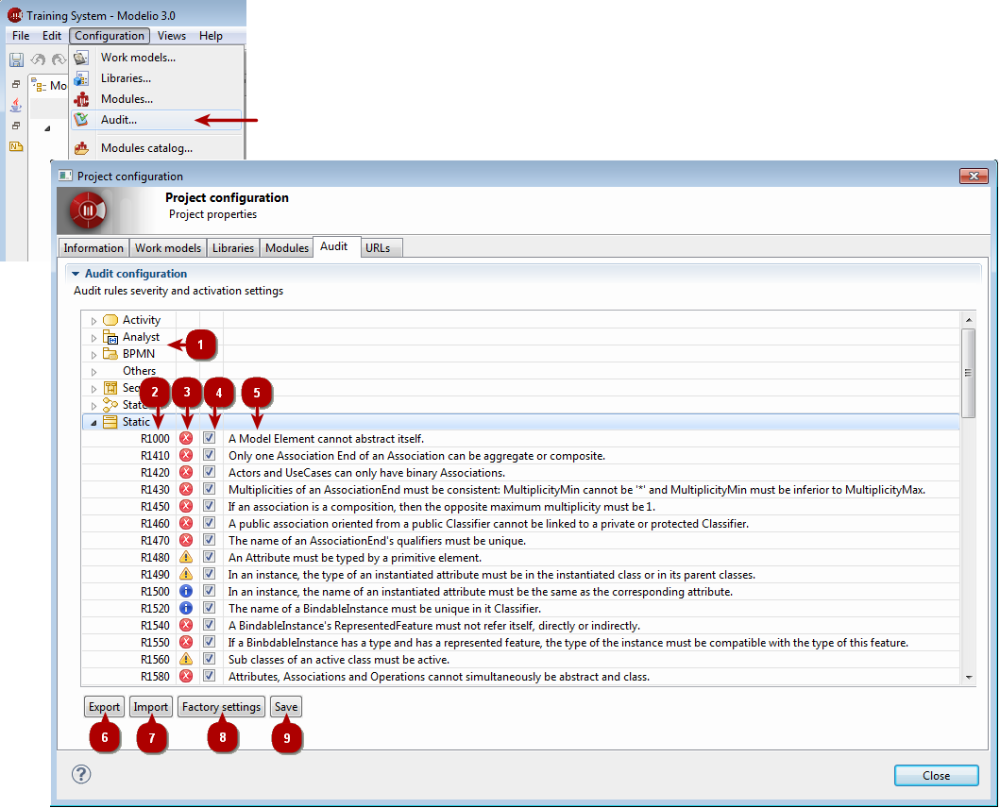

// Disable all captions for figures.
:!figure-caption:
// Path to the stylesheet files
:stylesdir: .

= Configuring project audit

Modelio comes with an extensive set of pre-defined audit rules to help you build sound, correct models. +
Each of these rules can be enabled, disabled or configured for different severity levels.

.The Audit configuration tool

*Keys:*

1. Rules are organized by metaclass.
2. Audit rule number.
3. Audit rule severity. This can be set to one of *Error*, *Warning* or *Advice*. This is the severity of the diagnostics that this rule will produce.
4. This tickbox enables/disables the rule. A disable rule is never controlled and produces no diagnostics.
5. Rule description.
6. Export the current configuration into a file (for example for re-use in another project).
7. Import configuration from a file.
8. Restore factory settings.
9. Save Audit configuration, apply the currently displayed configuration to the project.

