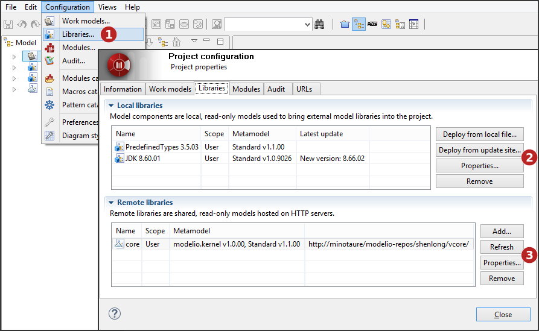
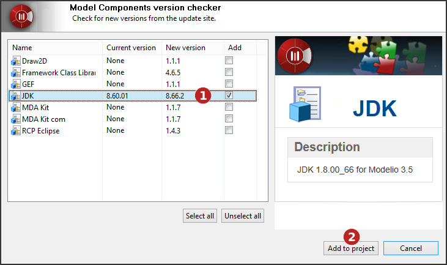
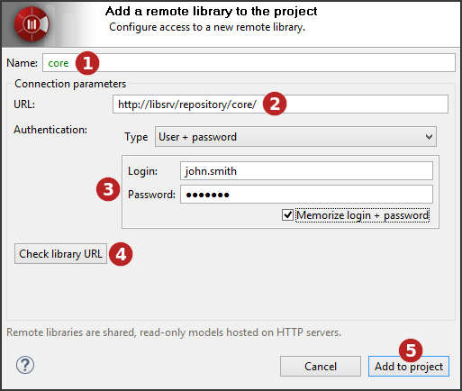

// Disable all captions for figures.
:!figure-caption:
// Path to the stylesheet files
:stylesdir: .

= Configuring project libraries

A *model library* or *library* in a Modelio project is a set of non-modifiable model elements that is required for the development of your project, packaged in a single artefact.

A very basic example for Java projects is the JDK. In order to properly model a Java application, many classes from the JDK are used either for extension by inheritance or as parts in the compositions and associations of your model. These required JDK classes are brought into your project via a *model library*. Obviously, your intention is not to edit or modify the JDK model, which is why the models provided by libraries are *read-only*.

There are two kinds of libraries in Modelio:

* *Model Component libraries* which are local libraries similar to the former model components of Modelio 2
* *HTTP Libraries* which are remote libraries, accessible via HTTP and consequently distributed

You can declare as many additional libraries in your project as required, mixing local and remote ones.

Library management is carried out in the *Libraries* tab of the *Project configurator* dialog.

.Configuring project libraries

1.  Click on "Configuration\Libraries..." or on the [image:images/Modeler-_modeler_managing_projects_configuring_project_libraries_config.png[3]] icon then select the 'Libraries' tab.
2.  You can add local libraries to your project, from a local file or from the update site, consult or remove existing ones.
3.  You can add remote libraries to your project, or refresh, consult or remove existing ones.

=== Adding model components

Model components are deployed by users who want to use them in their own projects. When a model component has been deployed in a project, it and the model elements it contains appear in the "Model" view in blue, and are in read- only mode.

To deploy a model component, there are two ways:

===== From a local file

.Deploying a model component from a local file
image::images/Modeler-_modeler_managing_projects_configuring_project_libraries_AddRamcPuces.png[7]

1.  Select the model component (*.ramc file) you wish to add to your project.
2.  Not all mandatory modules have been installed in the project in which you want to deploy the model component. If the model component you want to deploy includes note and tagged value types specific to a given module, then this module must be installed in your project before you deploy the model component. Missing modules are red. To solve this problem, simply run the "Configuration/Modules" command, and install the module you need.
3.  A <<Modeler-_modeler_local_libraries_model_components_lifecycle.adoc#,dependency>> that exists between the model component you want to deploy and another model component which must be deployed first in a project has not been respected. Missing model components are red. To solve this problem, simply first deploy the other model component (indicated in the "Dependencies" field) in your project, in the exact version stated, and then run the deployment operation for the model component you want to deploy again.
4.  Click on 'Add to project'.

===== From the update site

.Deploying model components from a the update site

1.  Select the model component(s) you wish to add or update in your project.
2.  Click on 'Add to project'.

*Note:* The update site address is defined by the 'Update site' option of the 'Updates' group in the Modelio preferences ("Configuration / Preferences" menu)

For further information on local libraries (model components), please see "<<Modeler-_modeler_local_libraries_model_components_presentation.adoc#,Introducing model components>>".

===== Adding remote libraries

Remote libraries are deployed by users wishing to use them in their own projects. When a remote library has been deployed in a project, it and the model elements it contains appear in the "Model" view in blue, and are in read- only mode.

To deploy a remote library, carry out the steps shown in the screenshots below.

.Deploy a remote library

1.  Enter the name that will be used for the remote library in the model explorer.
2.  Enter the remote library URL.
3.  If necessary, enter the user and password.
4.  You can check the remote library URL.
5.  Click on 'Add to project'.

For further information on remote libraries (HTTP models), please see "<<Modeler-_modeler_remote_libraries_distant_libraries_presentation.adoc#,Introducing remote libraries>>".

