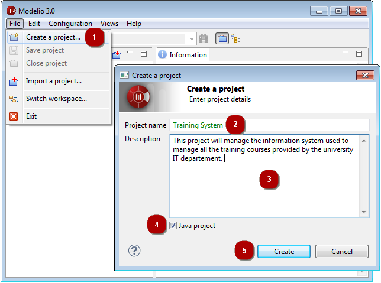

// Disable all captions for figures.
:!figure-caption:
// Path to the stylesheet files
:stylesdir: .

= Creating a project

.Creating a new project

*Steps:*

1. Click on "File\Create a project...".
2. Enter the name of the project.
3. Enter the description of the project.
4. You can choose to deploy the Java Designer module in your project by checking or not checking the "Java project" tickbox.
5. Click on "Create" to create and open the project.

*Note:* Each project name is unique, and it is not possible to create two projects with the same name.

