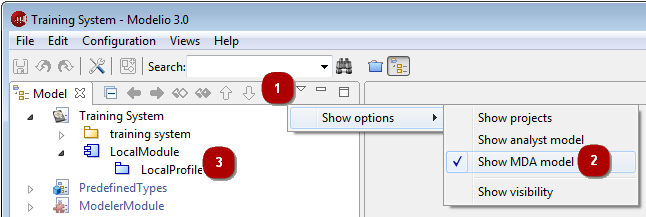
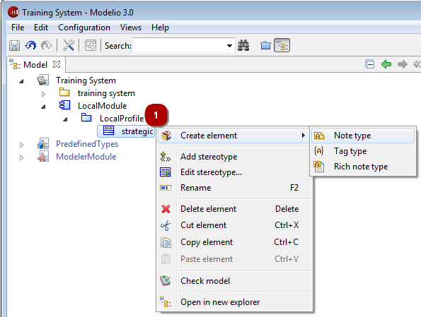

// Disable all captions for figures.
:!figure-caption:
// Path to the stylesheet files
:stylesdir: .

[[Advanced-level-ndash-Working-in-the-MDA-model]]

[[advanced-level-working-in-the-mda-model]]
= Advanced level – Working in the MDA model

[[Showing-the-MDA-model]]

[[showing-the-mda-model]]
===== Showing the MDA model

.Showing the MDA model

*Steps:*

1. Open the "Show options" menu.
2. Check the "Show MDA model" views option.
3. All deployed modules appear here, as well as "LocalModule", which is where you can create new MDA elements.

[[Creating-an-MDA-element]]

[[creating-an-mda-element]]
===== Creating an MDA element

In the MDA model, you can create the following MDA elements:

* On a module, you can create a profile.
* On a profile, you can create a stereotype.
* On a stereotype, you can create a note type or tagged value type.

The procedure for creating MDA elements is identical to that used to create model elements – just right-click on an element to open its context menu, click on "Create element" and then select the type of element you want to create. The newly created element is then immediately available for use in the Modelio modeling views.

The example below shows the creation of a note type on a stereotype.

.Creating a note type for a stereotype created earlier

