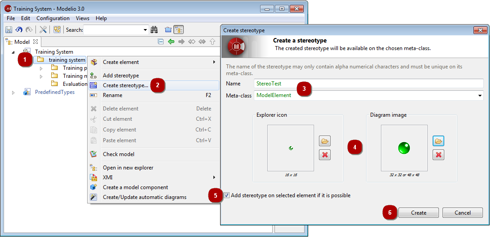

// Disable all captions for figures.
:!figure-caption:
// Path to the stylesheet files
:stylesdir: .

[[Basic-level-ndash-Creating-a-stereotype]]

[[basic-level-creating-a-stereotype]]
= Basic level – Creating a stereotype

.Creating a new stereotype

*Steps:*

1. In the Model view, select the element you want to create the new sterotype for.
2. Launch the "Create a stereotype..." command.
3. Enter a name for your new stereotype and select the metaclass it will apply to.
4. Select the images that will represent the stereotype in the explorers and diagrams.
5. If you want to immediately apply the new stereotype to the selected element, check this tickbox.
6. Finally, click on "Create".

If you checked the "Add stereotype on selected elements if it is possible" tickbox, the new stereotype is immediately added to the elements selected in the "Model" view.

*Note:* The stereotypes you create are created inside the Local module module.

