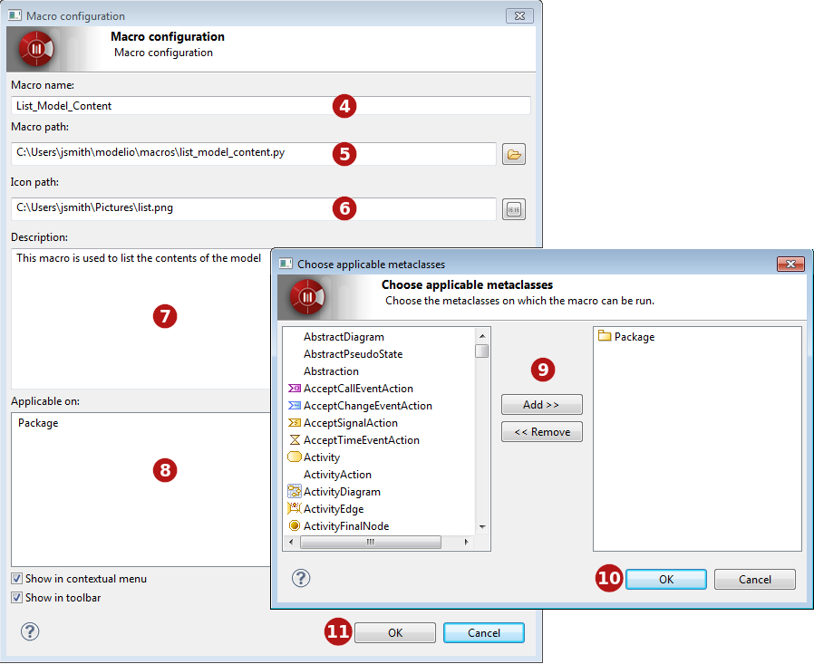

// Disable all captions for figures.
:!figure-caption:
// Path to the stylesheet files
:stylesdir: .

[[Macros-catalog]]

[[macros-catalog]]
= Macros catalog

[[Introducing-the-Modelio-macros-catalog]]

[[introducing-the-modelio-macros-catalog]]
===== Introducing the Modelio macros catalog

Modelio macros are Jython scripts which have been saved as files and which can be accessed via the Modelio interface in the same way as any other command. Macros have a name and can have an associated icon in the Modelio GUI.

The Modelio macros catalog organizes and displays all available macros, and shows the scope of each one, in other words, the level at which it can be run:

* Modelio: The macro is available in all projects in all Modelio workspaces.
* Workspace: The macro is available for all projects in the current Modelio workspace.
* Project: The macro is only available in the current project.

[[Creating-a-new-macro]]

[[creating-a-new-macro]]
===== Creating a new macro

If you intend to reuse a Jython script several times, you may want to create a new macro from it, as shown in the screenshots below.

image::images/Modeler-_modeler_modelio_settings_macros_catalog_scripts4.png[5]

.Opening the macro catalog and adding a macro

*Keys:*

1. Open the Macros catalog by running the "Configuration/Macros catalog" context menu command.
2. Select the level at which the macro will be available (Modelio, current workspace or current project).
3. Click on *Add file...*.
4. Choose a name for the macro. This is the name will appear in the context menu.
5. Select the script file you want to associate. For more information on saving script files, please see the section on <<Modeler-_modeler_handy_tools_scripts_macros.adoc#,scripts>>.
6. Select an icon to represent the new macro in the Modelio toolbar.
7. Write a description for the new macro.
8. Click in the *"Applicable on"* zone to open the metaclass selection window.
9. Add the metaclass on which the macro will be able to run.
10. Click on "OK" to validate.
11. Use these tickboxes to define where the macro can be run from. The *Show in contextual menu* tickbox will display the macro in the context menu, and the *Show in toolbar* tickbox will display the associated icon in the Modelio toolbar. You can choose to activate both these options.
12. Click on OK to confirm.

[[Running-a-macro]]

[[running-a-macro]]
===== Running a macro

Macros can be run via their associated buttons and context menu commands, where these have been defined.

Macros can also be run through the macro catalog window (accessed via the "Configuration/Macros catalog..." command). In this window, simply select the macro of your choice and click on Run.

