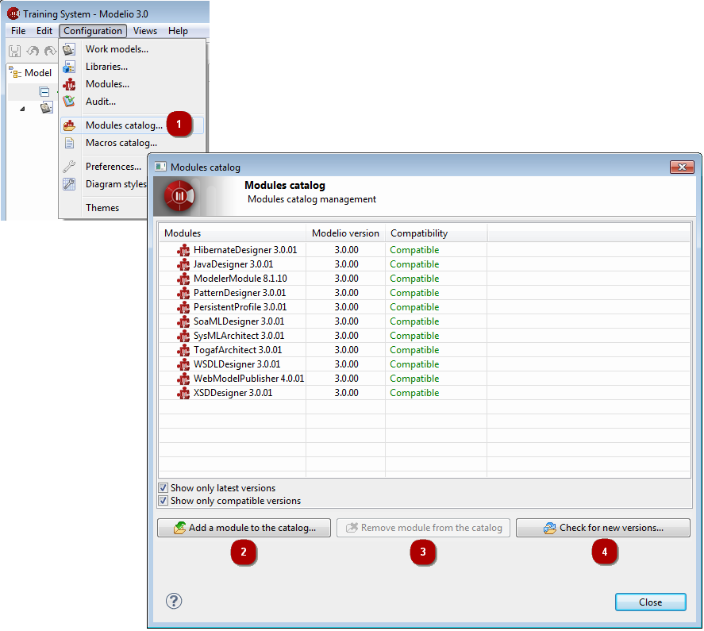

// Disable all captions for figures.
:!figure-caption:
// Path to the stylesheet files
:stylesdir: .

= The Modelio modules catalog

===== Introducing the Modelio modules catalog

The Modelio modules catalog is a list of all Modelio modules which are known to your local Modelio installation. By default, the modules that appear in the modules catalog are those provided with your Modelio installation, but you can also add other modules which you have downloaded or created yourself, for subsequent use in your Modelio projects.

*Note:* Adding a Modelio module to the modules catalog does not automatically select it for use in your current Modelio project. All modules that you want to use in a project must be selected via the "Configuration/Modules..." context menu command.

The three main columns in the "Modules catalog" window display the following information:

* The *Modules* column gives the name and version number of the module.
* The *Modelio version* column indicates the Modelio version required by the module.
* The *Compatibility* column shows whether the module is compatible with the current version of Modelio. +
This field has four possible values:
** *_Compatible_*, indicating that the compatibility of the module is certified.
** *_Update recommended_*, which indicates that the module should function correctly but that there may be a more recent version available.
** *_Incompatible: Modelio update required_*, indicating that the module requires a more recent version of Modelio than the one currently running.
** *_Incompatible: Module update required_*, which indicates that the module functions with older versions of Modelio and will not work with the one currently running.

The *Show only latest versions* tickbox is useful when several versions of a given module are known to your Modelio installation. In order to avoid listing all versions of a module, simply check this tickbox.

Similarly, the *Show only compatible versions* tickbox enables you to only display the list of modules which are compatible with your current version of Modelio.

===== Adding or removing modules from the modules catalog

To add or remove a module from the modules catalog, the *Add a module to this catalog...* and *Remove module from the catalog* buttons are used.

.The Modelio Modules Catalog

*Keys:*

1. Run the *Configuration /  Modules catalog...* command.
2. To add a module, click on *Add a module to the catalog...* and use the file browser to select the modules (*.jmdac files).
3. To remove a module, select the module in question and click on the *Remove module from the catalog* button.
4. To download new versions of modules into the catalog, click on *Check for new versions...*.

