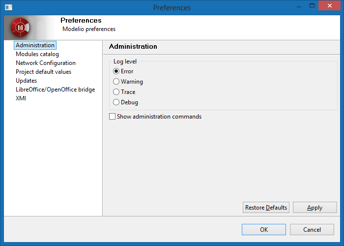
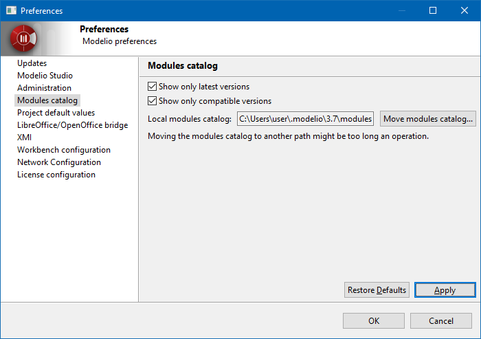
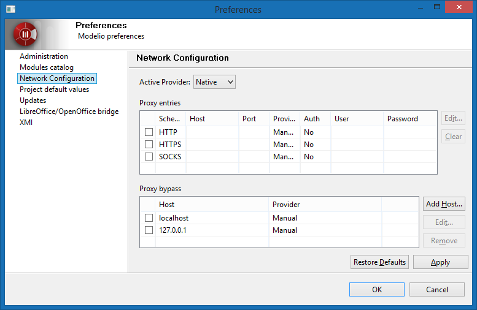
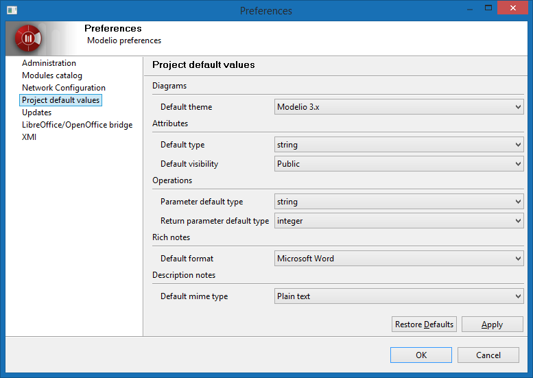
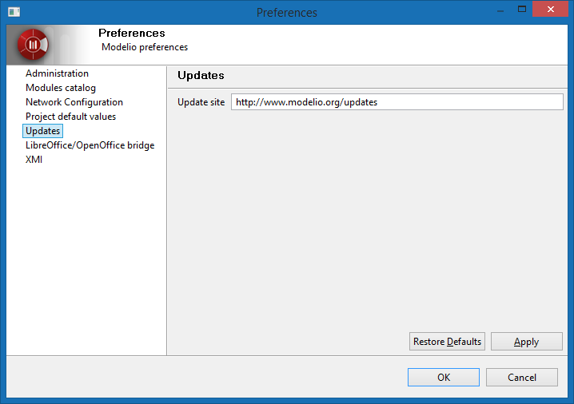
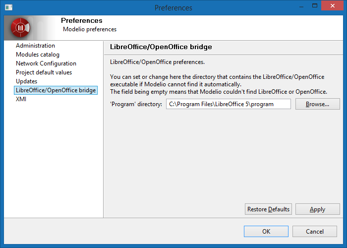
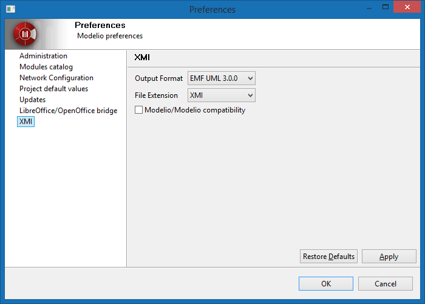

// Disable all captions for figures.
:!figure-caption:
// Path to the stylesheet files
:stylesdir: .
= Modelio preferences

===== Administration

In the *Administration* entry of the *Preferences* dialog, you can define the log level for Modelio and activate the administration commands.

*Define the log level for Modelio* By default the log level is set to *Error*, which only logs errors. This option is recommended +
to preserve the application performance and to avoid huge log files to be produced. +
Only in case of problems, should the more verbose levels *Warning, Trace, Debug* be used.

*activate the 'Administration' commands* These commands are available in the model root's context menu:

* *Deploy a module directly from a jmdac file...*: lets you deploy a module in the current project from the jmdac archive of the module. The deployed module will be stored in the modules catalog.
* *Defragment local model*: Impact links and various local data are stored in the 'local model'. As the model is being regularly saved, the local model fragments increasingly, occupying more and more disc space, and increasing the backup time. Defregmenting the local model will release disc space and reduce backup time.
* *Rebuild indexes*: Model indexes are used by Modelio to quickly search the model for elements. Rebuilding the indexes can fix '_shell_' elements. After the indexes have been rebuilt, the project needs to be closed and reopened for new indexes to be taken into account.
* *Defragment indexes*: The size of the indexes increases every time the model is saved. Indexes use more and more disc space and backup time. Defragmenting the indexes helps releasing disc space and reduce projects backup time.
* *Rebuild all impact models*: It may happen that SVN operations corrupt the impact model. This command rebuilds the whole imact model.

===== Module catalog

The Modelio modules catalog is the list of all modules which are known to your local Modelio installation. By default, the modules that appear in the modules catalog are those provided with your Modelio installation, but you can also add other modules which you have downloaded or created yourself, for subsequent use in your Modelio projects.

Upon opening the Modules catalog, the following options are activated by default:

* *Show only latest versions* : Several versions of a single module may coexist in the catalog. With this option on, only the latest version is displayed.
* *Show only compatibleversions* : Only modules which are compatible with the currrent version of Modelio are displayed.

By default, the modules catalog is located in the user folder:

* Linux / Mac OSX: `${HOME}/.modelio/4.1/modules`
* Windows: `%USERPROFILE%\.modelio\4.1\modules`

You can relocate Modelio's modules catalog. To do so, simply click on the 'Move modules catalog...' button and select a new location. The catalog contents will be moved to the chosen directory. Please note that this process may take a few minutes, depending on the catalog size and the machine's capacities.

===== Network configuration

This section lets you configure the connection to a proxy server.

In the "*Active Provider*", you can chosse :

* *Direct* : Select "Direct", if you don't need to use a proxy to connect.
* *Manual* : Select "Manual", if you need to define manually the settings
* *Native* : Select "Native", if you want to use the OS settings.

*Proxy entries* +
The table displays entries that are available for all providers. Checkboxes in the first column of the table indicate entries to be used for the currently selected provider.

When using Manual proxy provider there are three predefined schemas to set settings for: HTTP, HTTPS and SOCKS. Configuration for each schema is displayed in the Proxy entries table. To edit settings for a particular schema double-click the entry or select the entry and click Edit... button. If Port field is left blank default port number will be used. +
The list of default port numbers for each of the predefined schemas.

* HTTP : 80
* SSL : 443
* SOCKS : 1080

*Proxy bypass*

Use this table to specify, either by name or pattern, which hosts should not use any proxy. A direct connection will always be used for matching hosts. Checkboxes in the first column of the table indicate entries to be used for the currently selected provider.

===== Project default values

In the *Project default values* entry of the *Preferences* dialog, you can define some default values for the new created elements.

* *Diagrams* : Defines the default theme for new diagrams.
* *Attributs* : Defines the default type and visibility for new attributes.
* *Operations* : Defines the default type for new operations parameters and return parameters..
* *Rich Notes* : Defines the default MIME type for new rich notes created via the spreadsheet editor.
* *Description notes* : Defines the default MIME type (either raw text or HTML) for 'Description' notes.

===== Updates

The 'Update site' contains updates for Modelio, modules, and model components. +
By default, the URL points to the official Modelio update site.

===== LibreOffice/OpenOffice bridge

In the *LibreOffice/OpenOffice bridge* entry of the *Preferences* dialog, you can define the path to +
the LibreOffice or OpenOffice executables directory, in case Modelio cannot find it automatically, +
or if you want to use one Office suite instead of the other.

===== XMI

In the *XMI* entry of the *Preferences* dialog, you can define several options for the XMI import/export operations.

* *Output format*: Choose between a file compatible with the EMF 3.0.0 specification or the UML 2.1.1, UML 2.2, UML 2.3 or UML 2.4.1 specifications from the OMG.
* *File extension*: Specify the extension given to exported files (".xmi" or ".uml").
* *Modelio/Modelio compatibility*: Specifies whether or not maximum compatibility is activated when a re-import operation is run in Modelio.

