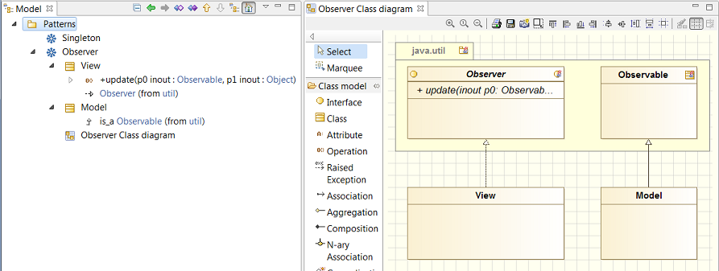
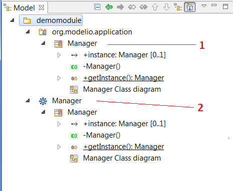
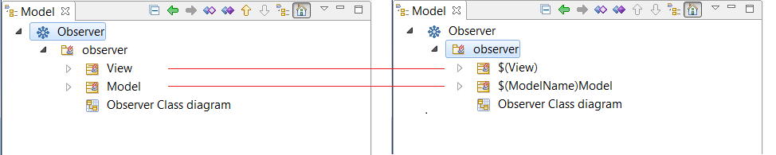
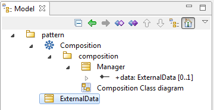

// Disable all captions for figures.
:!figure-caption:
// Path to the stylesheet files
:stylesdir: .

[[Model-patterns]]

[[model-patterns]]
= Model patterns

Model patterns are a powerful modeling feature of the Modelio modeler.

A pattern is a model fragment which can be reproduced infinitely in various environments, like an ink stamp duplicating an image at will. A pattern can also have parameters, in order to comply to specific contexts during its application, just like a date-stamp you can update everyday.

In practice, there are two important phases in the lifecycle of a pattern:

* The creation phase, which consist of:
** preparing the model example that will be reproduced during the application of the pattern
** preparing the pattern parameters, i.e. defining variation points for the pattern application
* The application phase which consist of using the pattern in a specific part of the model, setting its parameters if necessary, before executing the pattern and creating the corresponding model.

One of the main benefits of a pattern is that after a single creation, it can be applied N times, making its ROI proportional to N.

Modelio offers the following pattern-related features:

* *Pattern creation*
** Modeling of a UML model pattern, or extraction of a pattern from an existing model.
** Definition of pattern parameters.
* *Publication planning*
** Definition of the pattern packaging (name, version, labels, GUI, etc.)
** Exporting and sharing patterns between projects
* *Pattern use*
** Setting and applying patterns

[[Creating-a-pattern]]

[[creating-a-pattern]]
== Creating a pattern

A pattern can be created in two different ways:

1.  From scratch.
2.  From an existing model.

[[Creating-a-pattern-from-scratch]]

[[creating-a-pattern-from-scratch]]
=== Creating a pattern from scratch

To create a pattern from scratch, proceed as follows:

1.  From the model browser, run the command "Patterns/Create a Pattern/ Create an empty Pattern"
2.  Under the created Pattern element, build the desired content of the pattern in the form of a classic UML model (model elements, diagrams, etc.). That model will be the content of the new pattern.

The above picture shows a pattern named _Observer_, built over the JDK classes Observable/Observer. It shows the pattern content, the classes _View_ and _Model_, as well as their methods. Note that the diagram will be part of the pattern and will be procuced during its appplication.

The main advantage of this process is that it lets you create the whole model. Note that having to build the whole model can be a drawback too. +
For example, if the above 'Observer' pattern is meant to generate java code, as seems to indicate the generalization diagram, all the annotations and Java notes which are necessary to generate the code still have to be introduced, which can be quite tedious. +
It may happen that the desired content of the pattern is already available in complete and annotated models that you have at hand. Using those models as the basis for the building of a pattern is the second method.

[[Creating-a-pattern-from-an-existing-UML-model]]

[[creating-a-pattern-from-an-existing-uml-model]]
=== Creating a pattern from an existing UML model

Creating a pattern from an existing UML model is an easy task. It consists of identifying the parts of the existing model which represent the function you want to use as your pattern content, and converting them into a copy that will then become the pattern itself. The original model *will remain unchanged*.

To create a pattern from an existing UML model, proceed as follows:

1.  Select the element you want to use as the root of the model to use as a content for your pattern.
2.  Run the command "Pattern Designer / Create a pattern from the model"

The command will create a new pattern based on the copy of the selected UML model, as shown in the picture below:

In this example, the pattern creation command executed on the Java class *Manager*, let the original model unchanged, but made a copy (1) and converted it into a pattern (2).

[[Defining-parameters-for-a-pattern]]

[[defining-parameters-for-a-pattern]]
== Defining parameters for a pattern

Once the pattern has been created, it can be used, but it will reproduce strictly the same model as the one it is based on. +
Although this is already an interesting feature, it would be even better if the 'Observer' pattern would let you, for example, to rename the 'View' class in order to specialize it.

To do so, Modelio lets you define parameters, used to adapt the produced UML model to the current context when it is applied.

There are two kinds of parameters:

* The string type parameters,
* and the model element type parameters.

[[Defining-a-string-type-parameter]]

[[defining-a-string-type-parameter]]
=== Defining a string type parameter

Any string defined in the UML model can be converted into a pattern parameter. For example, the name of a model element, the content of a code note, or an element property, can all become a _String_ type parameter. To define a _String_ type parameter, replace the string with $(paramter's name). Any alphanumeric combination can be used as a parameter's name.

Example: Creation of the parameters $(View) and $(ModelName)

Modifiers can be added to the parameters:

* upper : Upper case string. Ex: $(view, upper)
* lower : Lower case string. Ex: $(view, lower)
* cfirst : String's first letter in Upper case. Ex : $(view,cfirst)
* lfirst : String's first letter in Lower case. Ex : $(view, lfirst)

[[Defining-a-model-element-type-parameter]]

[[defining-a-model-element-type-parameter]]
=== Defining a model element type parameter

Model element can also become pattern parameters. Those parameters have to be instantiated with a model element of the same kind during the application of the pattern.

Model element type parameter are automatically set when an element belonging to the pattern has a reference (attribute type, generalization link, etc.) to an element that is not part of the pattern. The latter can't belong to a model component (the parameter would then become a Constant)

Example : Creation of a class linked to another via a composition.

