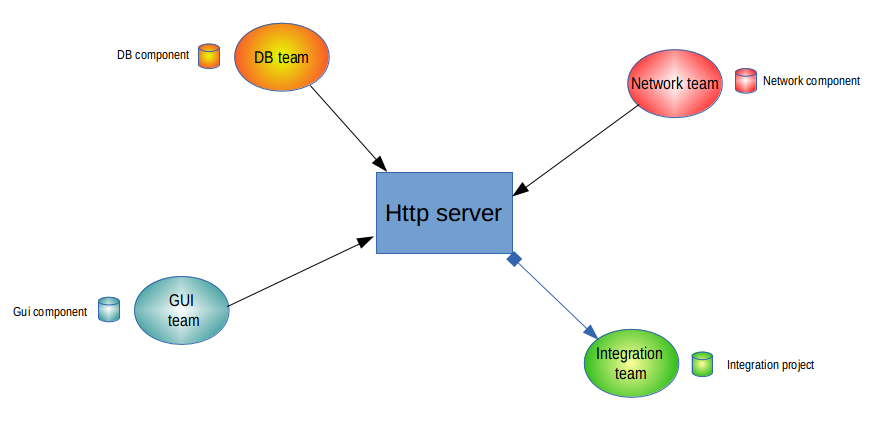

// Disable all captions for figures.
:!figure-caption:
// Path to the stylesheet files
:stylesdir: .

= Introducing remote libraries

===== What are remote libraries?

Remote libraries (also called HTTP models) are independent, identified and coherent parts of a larger model, made available on a network. The supported network protocol is http.

Remote libraries can contain any model, either complete including all annotations (tags, notes) or simplified limited to namespace and inheritance links, as is often the case for _Model Components_

===== What are the benefits of using remote libraries?

Being libraries, _remote libraries_ provide read-only model elements just like _Model Components_ (local libraries). They allow developers to share models through a network. For example, several geographically distinct teams can work together by sharing models in the form of libraries.

Compared to model components, HTTP models are not explicitly versioned. However, as they are read directly from the network instead of being installed locally, they benefit from an almost real-time update should they be modified. More exactly, their contents are refreshed each time the project referencing them is opened. In addition, the Modelio project configurator provides an explicit *Refresh* command in its _Libraries_ tab.

In a large scale multi-user development project, with several people working together at the same time on the same project, remote libraries are helpful because they allow each development team to progress in its own teamwork environment and according to its own schedule, without affecting the work of the other project participants.

In the following example, each team develop their own component and publish it on a common HTTP server in order to share their work. +
The integration team do not publish any model, but rather collect all the models to build the final application.

Several teams sharing HTTP libraries

=== Local or remote libraries for my project?

There is no universal answer to this question. +
However, the following facts might be worth considering when you are making your choice.

*Model components*

* are explicitly versioned and therefore well-identified
* once deployed they do not require an active network connection and may be slightly more efficiently browsed (local disk access compared to network access for HTTP models)
* require a deployment phase each time they have to be updated. Although such an operation is fast, it has to be carried out explicitly by the end-user, whereas an HTTP fragment is always up-to-date.

*HTTP libraries*

* are not explicitly versioned, and are identified only by their URL
* require an active network connection for their content to be available
* do not require deployment or updates. Each time the project is (re-)opened, the contents are up-to-date without any operations by the end-user.

From our experience, we recommend the use of _Model Component_ libraries for stable components that are used by your project and which are _external_ to your project, ie not developed in the project. For example, the JDK or other third-party software. If you plan to use _Model Components_ for parts of your project, which might be a perfectly good idea in some projects, prepare a well-defined process for the management of these components: version delivery, version publication, synchronous deployment for the whole team and so on. On the other hand, we recommend the use of _HTTP Libraries_ for your components in the projects. This way, different teams can stay up-to-date at the lowest possible cost, while still preserving a modular approach and avoiding the mortal syndrome of "anyone can modify anything".

