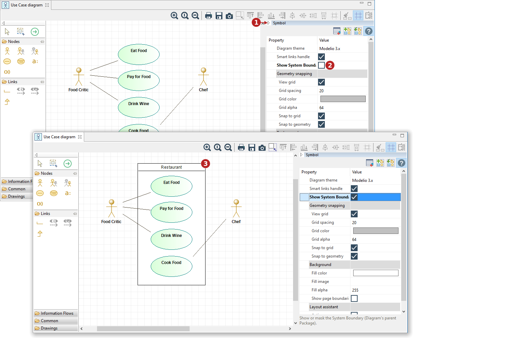

// Disable all captions for figures.
:!figure-caption:
// Path to the stylesheet files
:stylesdir: .

= Use Case diagram system boundaries

By default, a UseCase diagram does not show its system boundaries. The System Boundaries represent the diagram's parent package and are used to visually group related elements. +
To unmask them, you need to open the Symbol view of the diagram and check the appropriate option:

*Keys:*

1. Open the Symbol View tray on the diagram's right-hand side +
2. Check the 'Show System Boundaries' option +
3. The System Boundaries are now visible in the diagram

