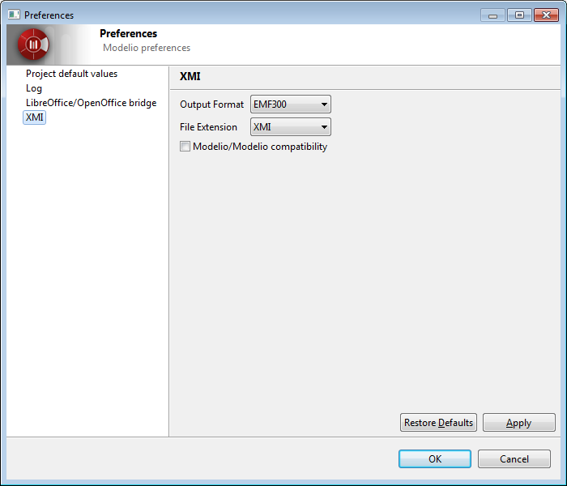

// Disable all captions for figures.
:!figure-caption:
// Path to the stylesheet files
:stylesdir: .

= Modelio XMI Import/Export options

===== Configuring Modelio XMI Import/Export

Modelio XMI parameters are used to modify the import and export behavior of the generator.

===== XMI configuration

The parameter set

[cols=",",options="header",]
|=====================================================================================================================================================================
|*Parameter* |*Use*
|Output format |Used to choose between a file compatible with the EMF 3.0.0 specification or the UML 2.1.1, UML 2.2, UML 2.3 or UML 2.4.1 specifications from the OMG.
|File extension |Specifies the extension given to exported files (".xmi" or ".uml").
|Modelio/Modelio compatibility |Specifies whether or not maximum compatibility is activated when a re-import operation is run in Modelio.
|=====================================================================================================================================================================

