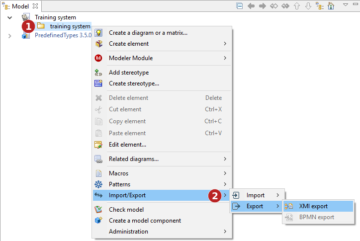

// Disable all captions for figures.
:!figure-caption:
// Path to the stylesheet files
:stylesdir: .

= Exporting a model in XMI format

===== Introduction

The Modelio XMI export operation is used to generate XMI files from models built in Modelio.

The "XMI Export" command can only be run from a package.

.The XMI Export command

*Keys:*

1. Right-click on a package to open the context menu.
2. Run the "Import/Export \ Export \XMI Export" command.

===== The "XMI Export" window

.The XMI export window
image::images/Xmi_exporting_xmiexportwindows.png[image]

*Keys:*

1. In this field, select the path of the file (which may or may not already exist) to which you want to export.
2. When the "Adding Modelio annotations" option has been activated, more information will be exported, ensuring maximum compatibility in the case of a re-import into Modelio. Some information available in Modelio but not present in UML2 can be retrieved in this way.
3. In the "Compatibility" field, select a format for the export. Choose between UML2.1.1, UML2.2, UML2.3, UML2.4.1 and EMF210.
4. In the "Extension" field, define the extension that will be assigned to the file you are going to export (either ".xmi" ou ".uml").
5. The progress bar shows the progress of the export operation

===== Partial export

With Modelio XMI Import/Export, you can carry out a partial export. To do this, simply run the export command from any of your project's "Package" type elements.

The scope of the export will then be limited to the sub-elements of the package from which the command is run. Any links to elements outside this package are severed.

