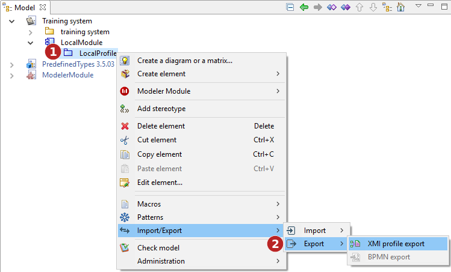
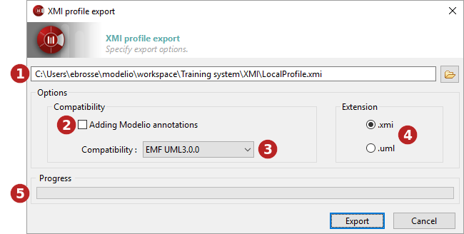

// Disable all captions for figures.
:!figure-caption:
// Path to the stylesheet files
:stylesdir: .

= Exporting a profile in XMI format

===== Introduction

The Modelio export profile operation is used to generate XMI files from profiles built in Modelio.

The "Profile export" command can only be run from a profile.

The XMI Export profile command

*Keys:*

1. Right-click on a profile to open the context menu.
1. Run the "Import/Export \ Import \Profile export" command.

===== The "XMI profile export" window

The XMI profile export window

*Keys:*

1. In this field, select the path of the file (which may or may not already exist) to which you want to export.
2. When the "Adding Modelio annotations" option has been activated, more information will be exported, ensuring maximum compatibility in the case of a re-import into Modelio. Some information available in Modelio but not present in UML2 can be retrieved in this way.
3. In the "Compatibility" field, select a format for the export. Choose between UML2.1.1, UML2.2, UML2.3, UML2.4.1 and EMF210.
4. In the "Extension" field, define the extension that will be assigned to the file you are going to export (either ".xmi" ou ".uml").
5. The progress bar shows the progress of the export operation

